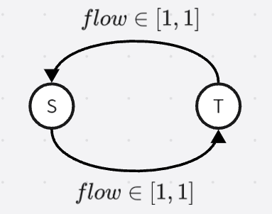

# 图论

- [图论](#图论)
- [图论基础](#图论基础)
  - [图的储存](#图的储存)
  - [欧拉图](#欧拉图)
  - [拓扑排序](#拓扑排序)
  - [最短路](#最短路)
- [最小生成树](#最小生成树)
  - [最小生成树性质](#最小生成树性质)
  - [最小生成树算法](#最小生成树算法)
  - [Boruvka 算法习题](#boruvka-算法习题)
  - [kruskal重构树](#kruskal重构树)
- [匹配](#匹配)
  - [二分图判定](#二分图判定)
  - [二分图最大匹配](#二分图最大匹配)
    - [匈牙利算法](#匈牙利算法)
    - [HK 算法](#hk-算法)
    - [König 定理](#könig-定理)
    - [Hall 定理](#hall-定理)
    - [其他结论](#其他结论)
    - [二分图完美匹配相关问题](#二分图完美匹配相关问题)
  - [二分图最优匹配](#二分图最优匹配)
  - [稳定婚姻系统](#稳定婚姻系统)
  - [一般图最大匹配](#一般图最大匹配)
  - [一般图最大权匹配](#一般图最大权匹配)
- [连通性](#连通性)
  - [无向图](#无向图)
    - [无向图 Tarjan 算法](#无向图-tarjan-算法)
    - [圆方树 Block-forest](#圆方树-block-forest)
    - [点双的其他结论](#点双的其他结论)
  - [有向图](#有向图)
    - [Kosaraju 算法](#kosaraju-算法)
    - [有向图 Tarjan 算法](#有向图-tarjan-算法)
    - [单向连通图](#单向连通图)
- [网络流](#网络流)
  - [流量网络](#流量网络)
    - [网络流图](#网络流图)
    - [可行流](#可行流)
    - [可改进路（增广路）](#可改进路增广路)
    - [残留网络](#残留网络)
    - [割切](#割切)
  - [流量网络的基本理论](#流量网络的基本理论)
  - [Ford-Fulkson 方法](#ford-fulkson-方法)
  - [Edmond-karp 算法](#edmond-karp-算法)
  - [Sap 算法](#sap-算法)
  - [Dinic 算法](#dinic-算法)
  - [寻找子图网络流模型](#寻找子图网络流模型)
  - [有向无环图的最少路径覆盖模型](#有向无环图的最少路径覆盖模型)
  - [最小费用最大流](#最小费用最大流)
  - [最小割](#最小割)
    - [最小化花费模型](#最小化花费模型)
    - [最大化价值模型](#最大化价值模型)
  - [有上下界的网络流](#有上下界的网络流)
    - [无源汇上下界可行流](#无源汇上下界可行流)
    - [有源汇上下界可行流](#有源汇上下界可行流)
    - [有源汇上下界最大流](#有源汇上下界最大流)
    - [有源汇上下界最小流](#有源汇上下界最小流)
    - [上下界最小费用可行流](#上下界最小费用可行流)
    - [有负环的费用流](#有负环的费用流)
  - [最小割树](#最小割树)

# 图论基础

图 $G = (V,E)$

## 图的储存
1. 邻接矩阵
2. $vector$
3. 邻接表
4. 链式前向星

## 欧拉图

如果图 $G$ 的一条路径经过每条边恰好一次，该路径称为欧拉路径；
如果一个回路是欧拉路径，则称之为欧拉回路。
具有欧拉回路的图称为欧拉图，具有欧拉路径但不具有欧拉回路的图称为半欧拉图。

一个图存在欧拉回路的充要条件

对于无向图，存在欧拉回路当且仅当
1. 连通
2. 所有顶点度数为偶数

对于有向图，存在欧拉回路当且仅当
1. 连通
2. 所有点入度等于出度

## 拓扑排序
有向无环图可以进行拓扑排序。
相关概念：$AOV$ 网，一个节点表示一个活动。

拓扑排序的应用
1. 判断图中是否存在环
2. 关键路径
    $AOE$ 网，边表示某个活动
    关键路径定义为源点到汇点的最长路径
    问题：
   - 整个工程至少需要多长时间完成？最长路
   - 那些活动是影响工程进度的关键（推迟会影响进度）？按拓扑序 $DP$ 计算最早开始时间，按逆序计算最晚开始时间，若一个节点的两种时间相同，它就是关键。

## 最短路
$u$ 到 $v$ 存在最短路的前提是 $u$ 无法经过负环再到达 $v$。

特殊图的最短路
1. 树，$DFS$
2. 有向无环图，拓扑$+DP$
3. 边权都一样的图，$BFS$

单源点最短路概念
- 求从一个点出发到其他顶点的最短路
- 基本操作：松弛。满足 $d_u + e(u,v) < d_v$ 的边 $(u,v)$ 被称为紧的，可以对它进行松弛操作。

$Dijkstra$ 算法
限制条件：图中不存在负边权
做法：从源点向外层扩展更新距离，每次取距离最短的点更新邻居
复杂度 $O((n+m)\log m)$

$Bellman-Ford$ 算法
解决了含负边权的有向图单源最短路问题
做法：枚举所有点，不断进行松弛操作，直到所有点都不能再操作
复杂度 $O(n^3)$

$SPFA$ 算法
是 $Bellman-Ford$ 算法的队列优化版本
做法：用队列存能进行松弛操作的节点，不断出队松弛，距离更新时入队
时间复杂度 最坏 $O(nm)$，平均 $O(10m)$
特点：可以判断是否存在负环。具体的，一个点入队超过了 $n$ 次；或者一个点及其所有前驱进行松弛操作的总次数到达了 $n$。

稠密图多源最短路
$Floyed$ 算法
动态规划思想，$f_{i,j,k}$ 表示 $i$ 到 $j$ 经过标号小于等于 $k$ 的点能得到的临时最短路，枚举中转点 $k$，更新 $f_{i,j,k} \leftarrow \max(f_{i,j,k-1},f_{i,k,k-1}+f_{k,j,k-1})$，可以用滚动数组不存第三维。
复杂度 $O(n^3)$

稀松图的多源最短路
如果没有负边，可以用 $n$ 堆优化的 $Dijkstra$ 代替 $Floyed$；
如果有负边权，可以先用一次 $SPFA$ 计算势能 $h_i$，改变边权 $w \leftarrow w+h_u-h_v$，此时再使用 $n$ 堆优化的 $Dijkstra$，得到的最短路实际为 $d_{u,v}+h_u-h_v$，此算法被称为 $Johnson$ 全源最短路径算法。
时间复杂度 $O(nm\log m)$

# 最小生成树
## 最小生成树性质
边权总和最小的生成树被称为最小生成树。
最小生成树的性质：
1. 最小生成树上任意两点 $u,v$ 路径上边权最大值，相比其他生成树是最小的。
2. 图 $G$ 的一颗生成树 $T$ 是最小生成树，等价于 $T$ 具有 $MST$ 性质：对于 $G$ 中任意一条不在 $T$ 上的边 $e$，将 $e$ 加入 $T$ 一定会产生回路，且 $e$ 是该回路上最大的边。

## 最小生成树算法
$prim$ 算法——加点法
贪心加入花费最小的点。具体的，从一个点开始向邻域扩张，维护一个扩张集合，每次选择集合与外部所连的最短的边加入最小生成树，对应点加入集合，共操作 $n-1$ 次。
复杂度 $O((n+m)\log m)$

$kruskal$ 算法——加边法
贪心选最短的边。具体的，对边按边权升序排序，对每条边依次判断，若选择后与之前选的边不形成环，选取作为 $MST$ 的一条边。
复杂度 $O(m\log m)$

$boruvka$ 算法
初始每个点自己是一个连通块，重复以下过程直到连通块数量为 $1$：
1. 对于每个连通块，考虑每一条连向外部的边，记录边权最小的那条边（这里需要固定所有边的偏序关系，如果出现相同边权可以比较边的下标或者两个顶点对）。
2. 对记录好的边依次舍取加入最小生成树，即选后不成环就加入，同时维护好连通块。

时间复杂度 $O(m\log n)$，因为每次操作 $2$ 连通块数至少减少一半。

## Boruvka 算法习题
任意两点 $u,v$ 都有边 $f(u,v)$，求最小生成树。
> 例：异或最小生成树：每个节点都有一个属性 $a_i, \text{for }i \in [1,n]$，任意两个节点间有边 $(u,v,a_u\oplus a_v)$，求最小生成树。

解法：考虑字典树上插入 $a_1,\ldots,a_n$，那么不管是 $kruskal$ 还是 $boruvka$ 的思想（每次选的是最短的边来合并连通块），那么对于字典树上一个左右子树都存在 $a_i$ 的节点，左子树形成连通块，右子树形成连通块后，这两连通块才会合并到一起，且一定会合并在一起，不会在更高处合并。
于是可以在字典树上分治，在合并时，暴力枚举所有左子树的节点，在右子树查找异或最小值，选一条最短的边加入最小生成树。
时间复杂度 $O(n\log n\log n)$，瓶颈在于，枚举左子树点时每个点最多被每个祖先枚举到 $O(n\log n)$，查询异或最小值 $O(\log n)$。

## kruskal重构树
- [博客园](https://www.cnblogs.com/ACMSN/p/10646306.html)
- [知乎](https://zhuanlan.zhihu.com/p/620736214)  

# 匹配
## 二分图判定
一个图是二分图 $\iff$ 图中至少两个点，且不存在奇环
两种判断二分图方式：
1. 黑白染色，出现矛盾时不是二分图
2. 带权并查集不断加边判断矛盾，**支持在线加边判断**

## 二分图最大匹配
在二分图中选出一组最大的边集，边之间无共用节点，即最大边独立集。

### 匈牙利算法
依次对左边每个点找增广路
复杂度 $O(nm)$

### HK 算法
$bfs$ 找增广路
时间复杂度 $O(m\sqrt n)$
可以用 $dinic$ 最大流代替
- [测试题](http://acm.hdu.edu.cn/showproblem.php?pid=2236)

### König 定理
二分图最大匹配数 $=$ 最小点覆盖数

### Hall 定理
二分图具有完美匹配 $\iff$ 对于左边任意子集 $S$，通过边连接的右边点集 $T$，都有 $|S| \le |T|$。

判断技巧
1. 左边选取点集进行判断时，他们的邻居要有交集，否则，完全可以分成几部分分别判断。
2. 选好右集合时，若左边有节点的邻居包含于右集合，这种点都要在左边选取以尽量尝试违背不等式。

[Hall定理应用的例题](https://ac.nowcoder.com/acm/contest/34649/L)

### 其他结论
定义：
1. 点覆盖：一个点集 $S$，满足对于图中每条边，它至少有一个端点位于 $S$ 中。
2. 边覆盖：一个边集 $E$，满足对于图中每个点，它至少有一条邻边位于 $E$ 中。
3. 点独立集：一个点集，集合中任意两点在原图中都不相邻。
4. 边独立集：一个边集，集合中任意两边在原图中无公共顶点。
5. 团：一个点集，集合中任意两点在原图中都相邻。
6. 补图：改变原图边集为相对完全图边集的补集，得到的图。

对于一般图或者二分图，有如下结论：
1. 图的最小边覆盖 $=$ 总节点数 $-$ 最大匹配数
2. 任意图中，点独立集和点覆盖是互补的，即任意一个点独立集的补集是一个点覆盖，任意一个点覆盖的补集也是一个点独立集。
3. 图的最大点独立集 $=$ 总节点数 $-$ 最小点覆盖数
4. 二分图最大点独立集 $=$ 总节点数 $-$ 最大匹配数
5. 图的最大团 $=$ 补图最大点独立集
6. 对二分图的边染色，满足相邻边不同色，最少需要的颜色数等于图中节点最大度数
7. 对图的点染色，满足相邻点不同色，最少需要的颜色数等于图的最大团大小

### 二分图完美匹配相关问题
> 判断一个二分图是否有且仅有唯一的完美匹配。[例题](https://www.luogu.com.cn/record/112738775)。

解决步骤
1. 如果原图存在重边，去除重边。
2. 使用队列，初始把所有度数为 $1$ 的节点入队。
3. 依次取出队首，如果当前它没有邻居，那么原图不具有唯一的完美匹配；否则，将其与邻居匹配上，更新邻居的邻居度数，若产生了新的度数为 $1$ 的叶节点，将叶节点入队。
4. 重复上述过程直到队列为空，最终若存在节点没有匹配上，那么原图不具有唯一的完美匹配；否则，具有唯一的完美匹配，这组匹配正是上述求得的。

> 给定一个二分图的完美匹配，依次判断每个节点是否能换掉匹配对象为其他节点，使得在此基础上其他节点仍然具有完美匹配。[例题](https://www.luogu.com.cn/problem/P1407)

解决步骤
1. 建有向图。
   1. 对于原配 $l_i, r_i$，连边 $(l_i, r_i)$
   2. 对于原图上其他的边 $(l_i, r_j)$，连边 $(r_j, l_i)$
2. 使用 $Tarjan$ 算法缩点。
3. 在同一个强连通分量内，任意与 $l_i$ 相邻的 $r_j$ 都可以变为 $l_i$ 新的匹配对象，满足其他节点仍然能完美匹配。因为这两节点匹配上之后，其他节点在二分图上可以沿着环类似找增广路依次匹配好。

## 二分图最优匹配
二分图最优匹配建立在“完美匹配”之上，所以必要时需要补点补边。
朴素 $KM$ 算法复杂度为 $O(n^2m)$，使用 $bfs$ 找增广路时间复杂度为 $O(n^3)$。

不过 [tourist submission](https://codeforces.com/contest/1955/submission/255672975) 的做法不需要保持两边点数相同，复杂度未知。

二分图最优匹配有如下应用
1. 求最优匹配，即一组边权和最大的**完美匹配**。
2. 求最大权匹配，即一组边权和最大的匹配。可以通过删除原图中的负边权，补充零边形成完全二分图，然后使用 $KM$ 算法求解。
3. 如果要求**边权之积**最大，对边权取 $\log$ 后，求最大权匹配，最后取 $\exp$ 即可。

## 稳定婚姻系统
> $n$ 男 $n$ 女，两两之间各有一定的好感度（甲乙对对方的好感度可能不一样），现在需要求一种匹配方案，使得对于任意一个人，他/她的除了配偶外好感度更高的人，对他/她的好感度不如当前自己的配偶。形式化的说，不存在两队配偶 $(a,b),(x,y)$ 满足 $w(a,y) > w(a,b) \And w(y,a) > w(y,x)$。

$Gale-shapley$算法
1. 对于每个单身男性，尝试追求未尝试过的好感度最高的女性。
2. 对于每位女性，接受一个自己好感度最高的追求者，拒绝其他男性（可能抛弃现任）。
3. 重复上述步骤直到没有单身男性。

复杂度 $O(n^2)$
“稳定”的正确性证明：
假设存在 $(a,b),(x,y)$ 满足 $w(a,y) > w(a,b)$（$a,x$是男性），那么 $a$ 之前一定追求过 $y$，一定有 $w(y,x) > w(y,a)$。

## 一般图最大匹配
带花树算法（$Blossom Algorithm$），复杂度 $o(n^3)$，[参考](https://oi-wiki.org/graph/graph-matching/general-match/)

## 一般图最大权匹配
带权带花树算法，复杂度 $O(n*m*log(n))$，[参考](https://www.luogu.com.cn/article/v30f81aa)

# 连通性

## 无向图
割点、割边（桥）
一个图如果不存在割点，称之为点双连通图，极大点双连通图称为点双连通分量。
一个图如果不存在割边，称之为边双连通图，极大边双连通图称为边双连通分量。

### 无向图 Tarjan 算法
$Tarjan$ 算法以 $dfs$ 方式遍历了所有节点，对每个连通分量形成了一颗 $dfs$ 树
- 时间戳 $dfn_u$ 表示 $u$ 是第几个被搜索到的节点
- 返祖边表示一个节点指向树上某个祖先节点的边
- 追溯值 $low_u$ 表示当前节点及其子树节点通过最多**一条**返祖边能连到的 $dfn_i$ 最小值
    - 初始 $low_u = dfn_u$
    - 在 $dfs$ 过程中遇到边 $(u,v)$，如果搜索树的边，更新 $low_u \leftarrow \min(low_u, low_v)$；如果是返祖边，更新 $low_u \leftarrow \min(low_u, dfn_v)$。注意代码实现时对于回头边不更新 $low_u$。

求割点
有如下两种情况：
1. 树根节点 $u$ 的孩子数 $>1$，$u$ 割开了几个子树
2. 非树根节点 $u$ 存在孩子 $v$ 满足 $dfn_u \le low_v$，$u$ 至少割开了 $v$ 子树

求桥
$(u,v)$ 是桥 $\iff$ 树上 $u$ 存在孩子 $v$ 满足 $dfn_u < low_v$

求边双连通分量
可以把桥删掉，再 $dfs$ 遍历即可求出；
不过有更简单的方式，在 $Tarjan-dfs$ 时维护一个栈，第一次遍历节点 $u$ 时把 $u$ 入栈，回溯时若满足 $dfn_u=low_u$，那么不断出栈直到 $u$ 出栈后，这些出栈元素一起构成了一个边双。

求点双连通分量
同样的，在 $Tarjan-dfs$ 时维护一个栈，第一次遍历节点 $u$ 时把 $u$ 入栈。
存在边 $(u,v)$ 且 $v$ 还没有被遍历情况下（即这条边是树边），在遍历完 $v$ 子树后，出现了 $dfn_u\le low_v$，此时不断出栈直到 $v$ 出栈后，这些出栈元素加上点 $u$ 一起构成了一个点双。

求每个点双连通分量内的包含了哪些边
1. 开一个栈，在 $u \rightarrow v$ 时，如果 $v$ 第一次被遍历，对边 $(u,v)$ 入栈
2. 在 $u \rightarrow v$ 时，如果 $v$ 被遍历过，即 $v$ 是 $u$ 的祖先，对边 $(u,v)$ 入栈（注意回头边不入栈，即判断条件为 $dfn[u] > dfn[v]$ 并且 $(u,v)$ 不是马上回头的边）
3. 在 $dfs$ 完 $v$ 子树后发现 $dfn_u<=low_v$，即 $u$ 时割点时，不断对边出栈直至边 $(u,v)$ 出栈，这些边就是此点双内部的边。

例题 [航电2023第五场](https://acm.hdu.edu.cn/showproblem.php?pid=7334) [牛客2023第六场](https://ac.nowcoder.com/acm/contest/view-submission?submissionId=63282947)

边双连通分量的缩点
每个边双是一个节点，原来的桥构成了边。

点双连通分量的缩点
每个点双是一个节点，额外保留割点，割点向点双连边，会形成一颗树，以某点双为根的话，树的奇数层是点双，偶数层是割点。

### 圆方树 Block-forest
与点双相关的另一种树形表示方式，圆方树有许多性质；
圆方树的构造：原图的点保留，称为*圆点*，对于点双标号 $n+1,n+2,\ldots,n+m$，称为*方点*，再对于所有原图的点向所在点双标号连边，就构成了圆方树，形状类似许多中心图在割点处连接。
注意每个连通块分别构成了一颗树，原图可能构成了一个森林。
性质：
1. 所有边都连接了圆点与方点，树的形状是若干个以方点为中心的菊花在某花边连接而成
2. 割点的数量小于 $n$，所以圆方树节点数小于 $2n$
3. 点双中任意两点 $u,v$ 之间一定存在一条简单路径能经过点双其他任意一点 $w$
4. 由上一条可以得出，两圆点在圆方树上的路径，与路径上经过的方点相邻的圆点的集合，就等于原图中两点简单路径上的点集

常用技巧：路径统计时，点赋上合适的权值，例如，每个方点的权值为对应点双的大小，每个圆点权值为 $-1$。

### 点双的其他结论
1. 如果一个点双连通分量中存在奇环，那么这个点双中所有节点都处在某个奇环上。

## 有向图
单向连通图：图中任意两点 $u,v$，存在 $u$ 到 $v$ 的路径，或者存在 $v$ 到 $u$ 的路径。
强连通图：图中任意两点 $u,v$，既存在 $u$ 到 $v$ 的路径，又存在 $v$ 到 $u$ 的路径。
弱连通图：图中有向边换成无向边后强连通。
强连通分量：极大的强连通子图。

### Kosaraju 算法
1. 对原图每个块进行 $dfs$ 入栈出栈，记录出栈顺序
2. 以出栈的逆序顺序对**反图**进行 $dfs$，每次 $dfs$ 能到达的节点一起作为一个强连通分量

### 有向图 Tarjan 算法
定义
- 时间戳 $dfn_u$ 表示 $u$ 是第几个被搜索到的节点
- $low_u$ 表示 $u$ 和它的子树里 *返祖边* 和 *横插边* 能连到的在栈中的 $dfn$ 最小的值

同无向图 $Tarjan$ 算法，维护一个 $dfs$ 栈，当搜索完 $u$ 子树回溯时发现 $dfn_u = low_u$，说明 $u$ 时所在强连通分量里最高的点，不断出栈直到 $u$ 被弹出，这些被弹出的元素一起组成了一个强连通分量。

### 单向连通图
又称半连通图，定义为满足 $\forall u,v \in V, (u,v) \in E | (v,u) \in E$ 的有向图。

一个有向无环图是半连通的 $\iff$ 存在一条单向路径覆盖了所有节点，即图的形状是一条单向链，附带了一些离链尾近的点指向离链尾远的点的有向边。

一个有向有环图是半连通的 $\iff$ 缩点之后的有向图是半连通的。

# 网络流

## 流量网络
想要将一些水从 $S$ 运送到 $T$，每条管道都有它的最大能容纳的水量，求 $S$ 到 $T$ 最多能流多少流量。

### 网络流图
若有向图 $G=(V,E)$ 满足下列条件时，称之为网络流图，记为 $G=(V,E,C)$：
1. 有且仅有一个顶点 $S$，它的入度为 $0$，即 $d^-(s)=0$，称 $S$ 为源点或发点
2. 有且仅有一个顶点 $T$，它的出度为 $0$，即 $d^+(s)=0$，称 $T$ 为汇点或收点
3. 每条边有非负权值 $C_{ij}$, 称为该边的容量

### 可行流
对于网络流图 $G$，每一条弧 $(i,j)$ 有流量 $f_{ij}$，满足下列三条件时，称之为可行流，记为 $f$：
1. 每条弧 $(i,j)$ 满足 $f_{ij} \le C_{ij}$
2. 流量平衡，即除 $S,T$ 外，每个节点 $v_i$ 满足入流等于出流 $\sum_j f_{ji} = \sum_k f_{ik}$
3. 对于 $S,T$ 有 $\sum_i f_{Si} = \sum_j f_{jT} = V(f)$

### 可改进路（增广路）
对于可行流 $f = \{f_{ij}\}$，若某条边满足 $f_{ij} = C_{ij}$，称 $<v_i,v_j>$ 为饱和弧；若 $f_{ij} = 0$，称 $<v_i,v_j>$ 为零流弧。
对于一条从 $S$ 到 $T$ 的道路 $P$，把 $P$ 上与 $P$ 方向一致的弧称为正向弧，全体正向弧记为 $P^+$；相应的定义反向弧和 $P^-$；
给定一个可行流 $f$，$P$ 是从 $S$ 到 $T$ 的一条道路，如果满足：
- $\forall <i,j>\in P^+$，$f_{ij}$ 是非饱和弧，$\forall <i,j>\in P^-$，$f_{ij}$ 是非零弧

那么称 $P$ 是 $f$ 的一条可改进路，可通过修改 $P$ 上弧的流量，令整个流的流量放大。

### 残留网络
图中边剩余的容量和反向平衡的流量一起构成了残留网络；
残留容量 $C_f(u,v) = C(u,v) - f(u,v)$，残留网络 $G_f = (V, E_f)$

### 割切
$G = (V,E,C)$ 是网络流图，通过割掉一些边，把点集 $V$ 分为两部分 $A,B$，其中源点 $S \in A$，汇点 $T \in B$，使得 $A$ 中的点无法到达 $B$，则称 $(A,B)$ 为一个割切。被割掉的边的容量之和称为割切的容量 $C(A,B)$。

## 流量网络的基本理论
有如下定理
1. 对于一个网络的任意可行流 $f$ 和割切 $(U,W)$，有 $V(f) \le C(U,W)$
2. 可行流 $f$ 是最大流 $\iff$ $f$ 中不存在可改进路
3. 整流定理：如果网络中所有弧的容量为整数，则存在整数值的最大流
4. 最大流最小割定理：$\max V(f) = \min C(U,W)$

## Ford-Fulkson 方法
扩充路径方法，不断寻找增广路

## Edmond-karp 算法
使用 $BFS$，时间复杂度为 $O(n*m*m)$

## Sap 算法
采用距离标号的方法求最短增广路，是 $push\_relable$ 压入重标记法类的算法
复杂度 $O(n^3)$

## Dinic 算法
$BFS$ 分层
复杂度 $O(n^2m)$

## 寻找子图网络流模型
> 给定一个有向图，找到一个某种形状的子图，子图上每个节点的入度出度都满足一定条件，如构成一条链、一棵树或者某个有向图等。

网络流建图步骤
1. 拆点，对于每个节点 $u$，变为两节点 $u,u^{'}$。
2. $\forall u \in [1,n]$，建边 $S \rightarrow u^{'}$，流量为 $out_u$。
3. $\forall u \in [1,n]$，建边 $u \rightarrow T$，流量为 $in_u$。
4. 如果原图存在边 $(u,v)$，建边 $u^{'} \rightarrow v$，流量为 $1$。

例题
1. 最小路径覆盖。入度出度均为 $1$。
2. $P5786$ 传感器网络。一颗树，入度为 $1$，出度二分判断。

## 有向无环图的最少路径覆盖模型
> 寻找一组路径数量最少的路径，路径之间**不能相交**，并且这组路径覆盖了图中全部节点。

解决步骤
1. 初始每个节点就是一条独立的路径，两条路径收尾相接可以合并，使路径数减一。
2. 更形式化的说，每个节点只能有最多一条入边和一条出边，我们需要在此限制下保留尽量多的边。
3. 建新图，我们将每个点拆分为入点和出点，对于原图的边 $(u,v)$，我们在新图上连边 $(u_\text{出},v_\text{入})$，形成了一个二分图。
4. 保留尽量多的边的问题转换为求二分图最大匹配，原图最少路径覆盖数 $=$ 原图总点数 $-$ 二分图最大匹配数。

网络流解法
此问题也可以建图，使用最大流解决，本质和二分图匹配相同，连边如下
1. $(S,u_\text{出},1),\forall u \in [1,n]$
2. $(u_\text{入},T,1),\forall u \in [1,n]$
3. $(u_\text{出},v_\text{入},1),\forall (u,v) \in E$

> 寻找一组路径数量最少的路径，路径之间**可以相交**，并且这组路径覆盖了图中全部节点。

解决步骤
1. 修改原图，为每个节点加边，向所有后继能到达的节点连边，以此转化为路径不相交的问题。例如原图上找到的路径 $A \rightarrow B \rightarrow C$ 和另一条路径相较于 $B$ 点，那么在新图上，我们可以找到路径为 $A \rightarrow C$ 以避免相交问题，这与原问题等价。
2. 使用二分图最大匹配求解。

网络流解法
上述步骤中可能添加 $n^2$ 条边，而网络流建图不会改变边的数量级，连边如下
1. $(S,u_\text{出},1),\forall u \in [1,n]$
2. $(u_\text{入},T,1),\forall u \in [1,n]$
3. $(u_\text{出},v_\text{入},1),\forall (u,v) \in E$
4. $(u_\text{出},v_\text{出},1),\forall (u,v) \in E$，这一步就相当于与所有后继节点连边

对于有向有环图的可相交最少路径覆盖问题，可以缩点转化为上述问题。
[Ucup上的可相交最少路径覆盖模型例题](https://contest.ucup.ac/contest/1207/problem/6329)

## 最小费用最大流
边带有费用的网络流图 $G = (V,E,C,W)$，其中 $C$ 表示弧的容量，$W$ 表示边单位流量的费用
最小费用最大流即保证 $S$ 到 $T$ 流量最大前提下，使得所需费用最小
解决方式：以单位费用作为边权，在残量网络上用 $Spfa$ 寻找最短增广路，然后修改流量，重复操作直到无增广路。
还可以利用 $johnson$ 算法的技巧，使用 $Dijkstra$ 算法代替 $Spfa$。

## 最小割
寻找最小割的分割方案
在跑完最大流后的残量网络中，$S$ 能到达的点全被割在 $S$ 这边，其他点被割在 $T$ 上。

寻找割边最少的一组割
1. 求割边最少的最小割
   1. 跑最大流
   2. 把未满流的边容量改为 $INF$
   3. 把满流的边容量改为 $1$
   4. 再跑最大流得到的最小割，拥有最少的割边数
2. 求割边最少的割
  - 把所有边容量改为 $1$ 后跑最大流即可

### 最小化花费模型
技巧：把实际意义中不能同时共存的边在 $S$ 和 $T$ 之间串联起来，这样这些边至少会被割掉一个。
举例
有 $n$ 个物品和两个集合 $A,B$，如果一个物品没有放入 $A$ 集合会花费 $a_i$，没有放入 $B$ 集合会花费 $b_i$；还有若干个形如 $u_i,v_i,w_i$ 限制条件，表示如果 $u_i$ 和 $v_i$ 同时不在一个集合会花费 $w_i$。每个物品必须且只能属于一个集合，求最小的代价。

做法
第 $i$ 个点由 $S$ 连一条容量为 $a_i$ 的边、向 $T$ 连一条容量为 $b_i$ 的边。对于限制条件 $u,v,w$，我们在 $u,v$ 之间连容量为 $w$ 的双向边。
最终割完后与 $S$ 相连的点集放入了 $A$ 集合，与 $T$ 相连的点集放入了 $B$ 集合，最小割即最小代价。

### 最大化价值模型
最大权闭合子图：在一个有点权有向图中选择一个点权和最大的子图，满足子图每个点的后继都在子图中，即闭合。

使用最小割解决
1. $S$ 向正权点连边，容量为点权
2. 负权点向 $T$ 连边，容量为点权绝对值
3. 原图的边仍然存在，容量为 $INF$

求出一个最小割，割开后，与源点 $S$ 连通的点即一组方案，构成了最大权闭合子图；
最大权值和为 正权值之和 $-$ 最小割大小

## 有上下界的网络流
本节参考笔记：[算法学习笔记(60): 上下界网络流](https://zhuanlan.zhihu.com/p/324507636)

在本节讨论中，有源汇网络流图中的源点可能是有入边的，汇点可能有出边。
所以说，源点到汇点的净流量 **不一定等于** 图中所有源点到汇点的路径流量之和，而应该是一个源点出流量减去入流量，例如下图中，规定两条边的上下界均为 $1$，那么可行流就是两条边均满流，注意到边 $S \rightarrow T$ 的流量为 $1$，但是源点到汇点的流量为 $0$，而不是 $1$。

无源汇网络流图和有源汇网络流图的区别是，无源汇网络流图中所有点的入流都等于出流，而有源汇网络流图中 $S$ 的入流小于等于出流，$T$ 的入流大于等于出流，其他节点入流等于出流。

### 无源汇上下界可行流
无源汇上下界可行流的求解步骤如下：
1. 把原网络按照每条边的上下界分解成*下界网络*和*差网络*。下界网络中每条边的边权是原边下界，差网络中每条边的边权是原边上界减去下界。
2. 为了让原网络每条边的下界流量得到满足，下界网络需要满流且流量平衡。当下界网络满流但不平衡时，需要差网络中边的流量来补充使其平衡。
   1. 计算下界网络每个点的入流与出流差值，即 $f_u = in_u - out_u$。
   2. 在差网络上建源点 $S_1$，汇点 $T_1$，连接*附加边*。对于每个下界网络上的点 $u$，若 $f_u > 0$，那么在差网络上连附加边 $(S_1,u,f_u)$，若 $f_u < 0$，那么在差网络上连附加边 $(u,T_1,|f_u|)$。
   3. 在差网络上 $S_1 \rightarrow T_1$ 跑最大流，若附加边全部满流，说明在下界网络中不平衡的流量在差网络中全部被平衡，原网络存在可行流：下界网络的满流 $+$ 差网络跑完最大流后非附加边的流量 $=$ 可行流。若附加边部分未满流，则原网络不存在可行流。

代码实现上，不需要建立下界网络，只需要计算每个节点的入流与出流差值。

在判断“附加边全部满流”时，不需要遍历所有附加边，只需要在连边时统计 $S_1$ 的出度，差网络最大流等于 $S_1$ 出度即“附加边全部满流”。

### 有源汇上下界可行流
在原网络中 $T$ 向 $S$ 连接一条下界为 $0$，上界为 $\inf$ 的*反流边*，然后当作无源汇上下界可行流来处理。

最后 $S \rightarrow T$ 的流量就是上述反流边流过的流量。

### 有源汇上下界最大流
步骤如下：
1. 按“无源汇上下界可行流”步骤进行，得到可行流。
2. 对差网络进行修改后继续“榨干”剩余网络。具体的，把反流边 $T \rightarrow S$ 删除（同时删除对应边$S \rightarrow T$，至于其他$S_1,T_1$上的附加边不必要删除），然后 $S \rightarrow T$ 跑最大流。
3. 步骤一中的反流边流量 $+$ 步骤二中的最大流流量 $=$ 最大流

### 有源汇上下界最小流
步骤如下：
1. 按“无源汇上下界可行流”步骤进行，得到可行流。
2. 对差网络进行修改后“尽量退回”剩余网络。具体的，把反流边 $T \rightarrow S$ 删除（同时删除对应边$S \rightarrow T$，至于其他$S_1,T_1$上的附加边不必要删除），然后 $T \rightarrow S$ 跑最大流。
3. 步骤一中的反流边流量 $-$ 步骤二中的最大流流量 $=$ 最小流

### 上下界最小费用可行流
与（有/无源汇）上下界可行流步骤相同，拆成两网络，附加边费用为 $0$，差网络跑最小费用最大流。

下界网络满流费用 $+$ 差网络费用 $=$ 最小费用可行流

### 有负环的费用流
[板子题](https://www.luogu.com.cn/problem/P7173)
对于正边正常建边，对于负数边，让负边强制满流，建立反流边，边权为正，对负边使用有上下界费用流的方式建立差网络，区别是最后下界网络没有满流不代表无解，实际上差网络上跑费用流的流量就是争取尽量多的负边被流过，然后接下来不删边，直接对原来的源汇点跑费用流，最小费用 $=$ 一开始负边满流的费用 $+$ 差网络第一次虚拟源汇点的费用流费用 $+$ 差网络第二次原来的源汇点费用流费用。

## 最小割树
求解任意两点之间的最小割
最小割树求解步骤如下：
1. 设原图为 $G$，建的树为 $T$，初始的 $T$ 为 $n$ 个孤点。
2. 在图 $G$ 中任意选两个点作为源汇点 $s,t$ 求一个最小割，在 $T$ 上连边 $(s,t,cut)$。
3. 最小割把原图分割成两个点集 $A,B$，分别对两点集递归上述步骤选取源汇点求最小割并连边，直到集合大小为 $1$，注意后续最小割都是在图 $G$ 上求得（而不是在导出子图上求）。
4. 最终连接了 $n-1$ 条边，得到最小割树 $T$。

代码实现上，不必要建立实际的树形结构，直接利用递归回溯时对 $\forall a \in A, \forall b \in B$，更新 $ge_{a,b} \leftarrow \min(ge_{a,s},ge_{s,t},ge_{t,b})$ 即可。