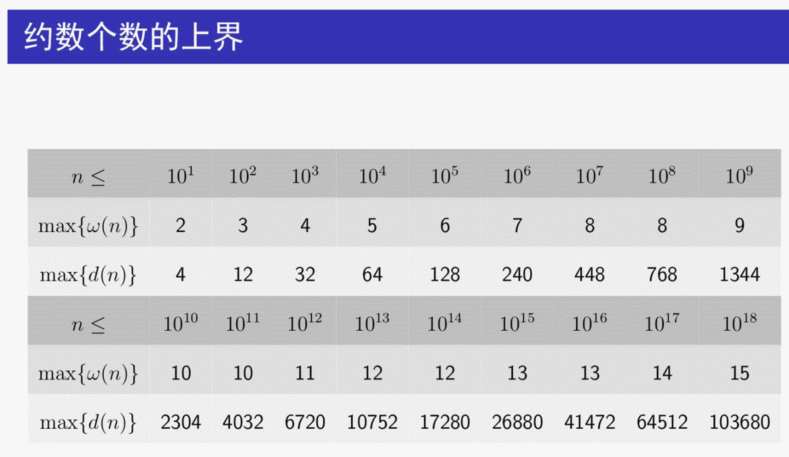
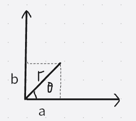
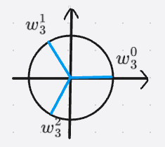
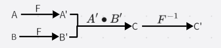
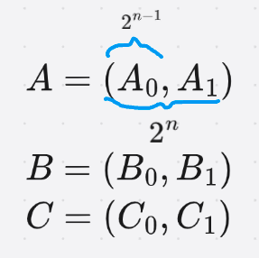

# 数学

- [数学](#数学)
- [第一章 整数分解与筛法](#第一章-整数分解与筛法)
  - [一些定义](#一些定义)
  - [欧几里得算法](#欧几里得算法)
  - [扩展欧几里得算法](#扩展欧几里得算法)
  - [算数基本定理](#算数基本定理)
  - [埃氏筛](#埃氏筛)
  - [欧拉筛](#欧拉筛)
  - [区间筛](#区间筛)
  - [质因数分解](#质因数分解)
  - [$MillerRabin$ 素性测试](#millerrabin-素性测试)
  - [$PollardRho$ 大整数分解](#pollardrho-大整数分解)
  - [不同范围的约数个数图](#不同范围的约数个数图)
- [第二章 同余与模](#第二章-同余与模)
  - [模 $m$ 等价类](#模-m-等价类)
  - [模意义下的一些公式](#模意义下的一些公式)
  - [欧拉函数](#欧拉函数)
  - [欧拉定理](#欧拉定理)
  - [费马小定理](#费马小定理)
  - [逆元求解方法](#逆元求解方法)
  - [同余方程组](#同余方程组)
  - [扩展欧拉定理](#扩展欧拉定理)
- [第三章 排列与组合](#第三章-排列与组合)
  - [一些定义](#一些定义-1)
  - [一些公式](#一些公式)
  - [求组合数](#求组合数)
  - [相关问题](#相关问题)
- [第四章 容斥原理](#第四章-容斥原理)
  - [定义](#定义)
  - [容斥原理的几个应用](#容斥原理的几个应用)
  - [容斥原理的符号形式](#容斥原理的符号形式)
  - [广义容斥原理](#广义容斥原理)
  - [反演](#反演)
  - [二项式反演](#二项式反演)
- [第五章 积性函数](#第五章-积性函数)
  - [积性函数定义和计算](#积性函数定义和计算)
  - [莫比乌斯反演](#莫比乌斯反演)
  - [狄利克雷卷积](#狄利克雷卷积)
  - [广义莫比乌斯反演](#广义莫比乌斯反演)
  - [实用公式](#实用公式)
  - [杜教筛](#杜教筛)
  - [$Min25$ 筛](#min25-筛)
- [第六章 矩阵与高斯消元](#第六章-矩阵与高斯消元)
  - [矩阵定义](#矩阵定义)
  - [矩阵乘法](#矩阵乘法)
  - [矩阵快速幂](#矩阵快速幂)
  - [广义矩阵乘法](#广义矩阵乘法)
  - [矩阵用法总结](#矩阵用法总结)
  - [线性方程组](#线性方程组)
  - [线性基](#线性基)
  - [秩](#秩)
- [第七章 生成函数](#第七章-生成函数)
  - [形式幂级数](#形式幂级数)
  - [生成函数](#生成函数)
  - [逆元](#逆元)
  - [常生成函数公式](#常生成函数公式)
  - [指数生成函数](#指数生成函数)
  - [指数生成函数公式](#指数生成函数公式)
- [第八章 FFT与拉格朗日插值](#第八章-fft与拉格朗日插值)
  - [多项式乘法优化思路](#多项式乘法优化思路)
  - [复数与单位根](#复数与单位根)
  - [$DFT$](#dft)
  - [$IDFT$](#idft)
  - [拉格朗日插值](#拉格朗日插值)
- [第九章 原根与 $NTT$](#第九章-原根与-ntt)
  - [阶与原根](#阶与原根)
  - [拉格朗日定理](#拉格朗日定理)
  - [原根的存在性](#原根的存在性)
  - [原根的判定](#原根的判定)
  - [寻找原根](#寻找原根)
  - [指标（离散对数）](#指标离散对数)
  - [求解离散对数](#求解离散对数)
  - [离散对数求高次剩余](#离散对数求高次剩余)
  - [$NTT$](#ntt)
  - [分治 $FFT/NTT$](#分治-fftntt)
- [第十章 生成函数进阶](#第十章-生成函数进阶)
  - [形式幂级数的更多运算](#形式幂级数的更多运算)
  - [多项式牛顿迭代](#多项式牛顿迭代)
  - [指数运算与对数运算的应用](#指数运算与对数运算的应用)
  - [第二类斯特林数](#第二类斯特林数)
  - [分拆数](#分拆数)
  - [球放盒子问题汇总](#球放盒子问题汇总)
  - [第一类斯特林数](#第一类斯特林数)
  - [两类斯特林数的联系](#两类斯特林数的联系)
  - [多项式在字符串匹配中的应用](#多项式在字符串匹配中的应用)
- [第十一章 $Polya$ 定理](#第十一章-polya-定理)
  - [$Burnside$ 引理](#burnside-引理)
  - [置换群的轮换指标](#置换群的轮换指标)
  - [$Polya$ 定理](#polya-定理)
  - [涂色问题总结](#涂色问题总结)
- [第十二章 数论问题杂谈](#第十二章-数论问题杂谈)
  - [整除分块](#整除分块)
  - [类欧几里得算法](#类欧几里得算法)
  - [二次剩余](#二次剩余)
  - [三次剩余](#三次剩余)
  - [最短线性递推式](#最短线性递推式)
  - [常系数齐次线性递推](#常系数齐次线性递推)
  - [$Lucas$ 定理](#lucas-定理)
  - [$exLucas$ 定理](#exlucas-定理)
- [第十三章 集合幂级数与 $FWT$](#第十三章-集合幂级数与-fwt)
  - [状态压缩](#状态压缩)
  - [集合幂级数](#集合幂级数)
  - [集合幂级数的卷积](#集合幂级数的卷积)
  - [$FMT/FWT$ 推导](#fmtfwt-推导)
  - [常见 $FWT$ 公式](#常见-fwt-公式)
  - [$FWT$ 的更多公式](#fwt-的更多公式)
  - [集合幂级数的更多运算](#集合幂级数的更多运算)
  - [子集卷积 $FST$](#子集卷积-fst)
- [第十四章 树与图上计数问题](#第十四章-树与图上计数问题)
  - [$prufer$ 序列](#prufer-序列)
  - [矩阵树定理](#矩阵树定理)
  - [$LGV$ 引理](#lgv-引理)
  - [树的拓扑序计数](#树的拓扑序计数)
- [第十五章 概率与期望](#第十五章-概率与期望)
  - [期望 $DP$](#期望-dp)
- [第十六章 重要数列汇总](#第十六章-重要数列汇总)
  - [卡特兰数](#卡特兰数)
- [第十七章 置换群与循环群](#第十七章-置换群与循环群)

# 第一章 整数分解与筛法

## 一些定义
1. 倍数、因数、整除，记号 `b|a`；
2. 余数，记号 `b%a`；
3. 最大公约数 记号 `gcd(a,b)` 或者 `(a,b)`；
4. 最小公倍数 记号 `lcm(a,b)` 或者 `[a,b]`；
5. 互质，即 $(a,b)=1$。

## 欧几里得算法
若 $a=b*q+c$，那么 $(a,b)=(b,c)$。

## 扩展欧几里得算法
> 若 $a,b$ 不全为 $0$，则 $\exist{x,y \in Z},ax+by=(a,b)$。

一、求特解  
找一组 $(x_0,y_0)$，满足 $ax_0+by_0=(a,b)$。  
列方程
$$
\begin{align*}
  ax_0+by_0 &= (a,b)\\
  bx_1+(a\%b)y_1 &= (b,a\%b)\\
  ax_0+by_0 &= bx_1+(a\%b)y_1 \\
  a(x_0-y_1) &= -b(y_0 - (x_1 - \lfloor \frac{a}{b} \rfloor y_1))
\end{align*}
$$ 
由于需要得只是一组合法解，不妨让上式两边关于 $x,y$ 的式子都等于 $0$，得
$$
\begin{gather*}
  x_0 = y_1 \\
  y_0 = x_1-\lfloor \frac{a}{b} \rfloor y_1
\end{gather*}
$$
于是可以先递归解方程 $bx_1+(a\%b)y_1=(b,a\%b)$  
当第二项系数等于 $0$ 时递归终止，得到解 $x=0,y=anything$  
回归时令 $x_0=y_1, y_0=x_1-\lfloor \frac{a}{b} \rfloor y_1$ 得到原方程的解

二、求通解  
通解为 $(x_0+k\frac{b}{(a,b)}, y_0-k\frac{a}{(a,b)}),k \in Z$。

更一般的，对于$(a,b) \mid d$ 的 $d$，$ax+by=d$ 的通解为 $(x_0\frac{d}{(a,b)}+k\frac{b}{(a,b)}, y_0\frac{d}{(a,b)}-k\frac{a}{(a,b)}),k \in Z$。

## 算数基本定理
任一大于 $1$ 的整数唯一表示成 $n=p_1^{\alpha_1}p_2^{\alpha_2}\cdots p_k^{\alpha_k}$，其中 $p_i \in Primes,p_i<p_{i+1},\alpha_i>0$。

## 埃氏筛
把质数的倍数标记为合数，复杂度 $O(n\log\log n)$。

## 欧拉筛
每个合数只被其最小的质因子筛掉，复杂度 $O(n)$。  

## 区间筛
求区间 $[L,U]$ 内的质数，其中 $U-L \le 10^6$  
解法：使用 $[2,\sqrt U]$ 内的质数标记 $[L,U]$ 内的合数，时间 $O(\sqrt U\log\log\sqrt U)$，空间 $O(\sqrt{U}+(U-L))$。

## 质因数分解
1. 朴素分解：用 $[2,\sqrt n]$ 以内的数试除；
2. 质因子优化：用 $[2,\sqrt n]$ 以内的质数试除，复杂度约 $O(\frac{\sqrt n}{\log \sqrt n})$；
3. 小范围情况：$n \le 10^7$，欧拉筛预处理每个数的最小质因子 $minp_x$，单次分解复杂度 $O(\log n)$。
4. Pollard_rho算法，期望 $O(n^{\frac{1}{4}})$

## $MillerRabin$ 素性测试
> 快速判断一个大数是不是质数

解：设 $p$ 是奇质数，那么 $p=2^sd+1$，其中 $s>0,d>0,d\equiv 1 \pmod 2$；  
由欧拉定理 $\forall a \in [1,p-1], a^{p-1} \equiv 1 \pmod p \implies a^{2^sd} \equiv 1 \pmod p$；  
于是要么 $a^d \equiv 1 \pmod p$，要么 $\exist r \in [0,s-1], a^{2^rd} \equiv -1 \pmod p$。

对于 $n<3$ 和 $n\equiv 0 \pmod 2$ 特判，对于 $n\ge 3$ 的奇数，考虑随机算法：  

随机选择 $a \in [1,n-1]$ 如果 $a$ 满足前面关于质数 $p$ 的结论，就称 $a$ 是 $n$ 的一个证人。可以证明对于合数 $n$，最多有 $\frac{n}{4}$ 个“说谎”的证人。  
因此检测 $t$ 次都是证人但 $n$ 是合数的概率最多 $\frac{1}{4^t}$。

实际应用时，对于 $n$ 的范围，选一组特定的 $a_1,\ldots,a_t$ 可以保证有一个诚实的证人：
- $n\le 2^{64}$，选择前 $12$ 个质数
- $n\le 3*10^{24}$，选择前 $13$ 个质数

时间复杂度 $O(t\log n)$。

## $PollardRho$ 大整数分解
> 快速对一个大整数进行质因数分解

解：对于一个非质数 $n$，一定能分解 $n=pq,p>1,q>1$，而该算法就是快速找到一个 $p|n$，对 $n$ 进行分解。

选一个模 $n$ 意义下的多项式 $g(x)$，例如 $g(x)=(x^2+c) \bmod n$ 充当伪随机数生成器，任选一个 $x_0\in [0,n-1]$，生成序列 $\{x_i\}(x_i=g(x_{i-1}))$，该序列很快会出现相同的数，形成“$\delta$”的形状，假设 $p|n$，那么 $\{x_i \bmod p\}$ 也会形成该形状，且环长更短。

期望时间复杂度 $O(n^\frac{1}{4})$

## 不同范围的约数个数图
设 $n=p_1^{a_1}*p_2^{a_2}...*p_k^{a_k}$

$w(n)$ 表示 $n$ 不同质因子个数，即 $k$。

$d(n)$ 表示 $n$ 的因子个数，即$\prod_{i=1}^{k}(1+a_i)$

# 第二章 同余与模

## 模 $m$ 等价类
同余：$a \equiv b \pmod m$。  
等价类：$I = \{x|x \equiv i \pmod m \},i \in Z$。  
等价类上的运算：  
在 $Z_m = \{I_0,I_1,\ldots, I_{m-1}\}$ 域内定义两种运算 $+,*$，满足  
- $A+B=C$ 当且仅当 $\forall a \in A, b\in B, a+b \in C$；
- $A*B=C$ 当且仅当 $\forall a \in A, b\in B, a*b \in C$。

逆元  
如果 $A,B \in Z_m$，满足 $A*B=I_1$，则称 $B$ 是 $A$ 的逆元，记作 $A^{-1}$。  
$$
ab \equiv 1 \pmod m \implies ab-km=1
$$
可以使用扩展欧几里得算法求出 $a$ 的逆元 $b$：
- $a$ 在 $Z_m$ 内有逆元，当且仅当上述方程有解，应满足 $(a,m)=1$；
- 如果 $m$ 为质数，那么 $\forall{m \nmid a}$，$a$ 在 $Z_m$ 内有逆元。

## 模意义下的一些公式
如果 $b \mid a$，那么
$$
\frac{a}{b} \bmod p = \frac{a \bmod bp}{b}
$$  
如果 $a \equiv b \pmod p$，那么
$$
\frac{a}{x} \equiv \frac{b}{x} \pmod{\frac{p}{(p,x)}}
$$

## 欧拉函数
定义：$\phi(n) = \sum\limits_{i=1}^n [(i,n)=1]$。  
设 $n=p_1^{\alpha_1}p_2^{\alpha_2}\cdots p_k^{\alpha_k}$，则 $\phi(n)=(p_1-1)p_1^{\alpha_1-1}(p_2-1)p_2^{\alpha_2-1}\cdots(p_k-1)p_k^{\alpha_k-1}$。

求法：
1. $\phi(n)$ 是积性函数，使用欧拉筛 $O(n)$ 求解；
2. 利用质因数分解求解。

## 欧拉定理
如果 $(a,m)=1$，那么 $a^{\phi(m)} \equiv 1 \pmod m$。

## 费马小定理
$p$为质数，如果 $p \nmid a$，那么 $a^{p-1}\equiv 1 \pmod p$，其实是欧拉定理的特例。

## 逆元求解方法
当 $(a,m)=1$ 时，$a$ 在 $Z_m$下存在逆元
1. 扩展欧几里得求解 $ax-my=1$ 得 $a^{-1}=x$；
2. 欧拉定理 $a^{-1} \equiv a^{\phi(m)-1} \pmod m$；
3. 若 $p$ 为质数，有公式 $i^{-1} = -\lfloor \frac{p}{i} \rfloor * (p\%i)^{-1}$，可以 $O(p)$ 预处理所有逆元。

## 同余方程组
> 求解方程组
> $$
\begin{cases}
  x \equiv a_1 \pmod{m_1}\\
  x \equiv a_2 \pmod{m_2}\\
  \cdots \\
  x \equiv a_k \pmod{m_k}\\
\end{cases}
$$

一、扩展中国剩余定理  
每次合并两个方程 
$$
\begin{gather*}
  x = y_1m_1+a_1 = y_2m_2+a_2 \\
  \iff  y_1m_1-y_2m_2=a_2-a_1
\end{gather*}
$$
使用扩欧求解 $y_1$，然后得到 $x$ 的解，解的形式为 $x \equiv x_0 \pmod{[m_1,m_2]}$。  
最终得到通解为 $x \equiv x_0 \pmod{M}$，其中 $M=[m_1,m_2,\ldots,m_k]$。  
原方程有解当且仅当扩欧有解，即每一步都要满足 $(m_1,m_2) \mid a_2-a_1$。  
注意到上述每一步推导是充要的，所以原方程和最终的解是一一对应的，即如果给定 $m_1,\ldots,m_k$，那么解 $x=0,\ldots,M-1$ 与 $M$ 个原方程唯一对应，剩余 $m_1*m_2*\cdots *m_k-M$ 个方程都无解。

二、中国剩余定理  
> 适用条件：方程组中的模数 $m_1,\ldots,m_k$ 两两互质。

构造解 $x \equiv \sum\limits_{i=1}^k M_i' M_i a_i \pmod M$，其中 $M = m_1*m_2*\cdots*m_k,M_i=\frac{M}{m_i},M_i' \equiv M_i^{-1} \pmod{m_i}$

## 扩展欧拉定理
$a^c \equiv a^{c\%\phi(m)+\phi(m)} \pmod{m}, \text{if } c \ge \phi(m)$

# 第三章 排列与组合

## 一些定义
下降幂 $n^{\underline{r}}=n*(n-1)*\cdots*(n-r+1)$。  
上升幂 $n^{\overline{r}}=n*(n+1)*\cdots*(n+r-1)$。  
阶乘 $n!=n*(n-1)*\cdots*1$。  
组合数 $\binom{n}{r}=\frac{n^{\underline{r}}}{r!}=\frac{n!}{(n-r)!r!}$。  

## 一些公式
$$
\begin{align*}
  & \binom{n}{m} = \binom{n-1}{m-1}+\binom{n-1}{m}\\
  &\binom{n}{m} = \frac{n}{m}\binom{n-1}{m-1}\\
  &\binom{n}{m} = \frac{n-m+1}{m}\binom{n}{m-1}\\
  &\text{交错和 }\sum_{i=0}^n(-1)^i\binom{n}{i}=0\\
  &\sum_{i=0}^n\binom{n}{i}[i\%2=0]=\sum_{i=0}^n\binom{n}{i}[i\%2=1]=2^{n-1}\\
  & \text{变下项求和 } \sum_{i=0}^n\binom{n}{i}=2^n\\
  &\sum_{i=0}^ni\binom{n}{i}=n2^{n-1}\\
  & \sum_{i=0}^n i^2 \binom{n}{i}=n(n+1)2^{n-2}\\
  &\sum_{i=0}^n\binom{n}{i}^2=\binom{2n}{n}\\
  &\text{变上项求和 } \sum_{i=m}^n\binom{i}{a}=\binom{n+1}{a+1}-\binom{m}{a+1}\\
  &\text{上下同时变 }\sum_{i=m}^n\binom{a+i}{i}=\binom{a+n+1}{n}-\binom{a+m}{m-1}\\
  &\text{积 } \binom{n}{r}\binom{r}{k}=\binom{n}{k}\binom{n-k}{r-k}\\
  &\text{积之和 } \sum_{r=k}^n\binom{n}{r}\binom{r}{k}=2^{n-k}\binom{n}{k}\\
  &\sum_{k=0}^r\binom{m}{k}\binom{n}{r-k}=\binom{m+n}{r}\\
  &\sum_{k=0}^r \binom{m}{k}\binom{n}{k}=\binom{m+n}{r},\text{其中 }r=min(n,m)\\
  &\text{其他 }\sum_{r=0}^k\binom{n+r-1}{r}=\binom{n+k}{k}\\
\end{align*}
$$

## 求组合数
1. 用定义直接算，乘大除小交替可避免溢出，复杂度 $O(nq)$；
2. 杨辉三角形，复杂度 $O(n^2+q)$；
3. 模意义下，预处理阶乘和阶乘逆元，单次询问复杂度 $O(n+q)$。

## 相关问题
> 求不定方程 $x_1+x_2+\ldots+x_k=n,x_i\ge 1$ 解的数量。

解：使用隔板法，答案为 $\binom{n-1}{k-1}$。

> 求不定方程 $x_1+x_2+\ldots+x_k=n,x_i\ge a_i$ 解的数量。

解：相当于 $y_i=x_i-(a_i-1) \ge 1$，答案为 $\binom{n-\sum(a_i-1)-1}{k-1}$。

> 求不定方程 $x_1+x_2+\ldots+x_k \le n$ 解的数量。

解：相当于 $x_1+x_2+\ldots+x_k+z = n$ 的解。

> 已知 $a_1\le a_2\le \cdots\le a_n$，求 $f_i=\sum\limits_{j=0}^{a_i}\binom{i}{j}$，其中 $i=1,\ldots,n$。

解：推式子得 $f_{i+1}=2f_i-\binom{i}{a_i}+\sum\limits_{j=a_i+1}^{a_{i+1}}\binom{i+1}{j}$，复杂度 $O(a_n)$

# 第四章 容斥原理

## 定义
设 $S$ 是一个有限集合，$A_1,\dots,A_n$ 是 $S$ 的子集，则：
$$
  \left\vert S-\bigcup_{i=1}^nA_i \right\vert=\sum_{i=0}^n(-1)^i\sum_{1\le j_1 < j_2 < \dots < j_i \le n} \left\vert \bigcap_{k=1}^iA_{j_k} \right\vert
$$  
其中，$i=0$ 时 $\left\vert \bigcap_{k=1}^iA_{j_k} \right\vert$ 定义为全集 $S$。

## 容斥原理的几个应用
> 计算 $\phi(n)$，$\phi(n)$ 表示 $[1,n]$ 中与 $n$ 互质的数的个数。  

解：设 $n=p_1^{\alpha_1}*p_2^{\alpha_2}*\dots*p_k^{\alpha_k}$，全集 $S=\{1,\dots,n\}$，集合 $A_i=\{x|p_i \mid x,x \in S\},i=1,\dots,k$，则
$$
\begin{align*}
  \left\vert S-\bigcup_{i=1}^kA_i \right\vert &= \sum_{i=0}^k(-1)^i\sum_{1\le j_1 < j_2 < \dots < j_i \le k} \left\vert \bigcap_{k=1}^iA_{j_k} \right\vert\\
  & = \sum_{i=0}^k(-1)^i\sum_{1\le j_1 < j_2 < \dots < j_i \le k} \frac{n}{p_{j_1}p_{j_2}\dots p_{j_i}}\\
  & = n*(1-(\frac{1}{p_1}+\frac{1}{p_2}+\dots+\frac{1}{p_k})+(\frac{1}{p_1p_2}+\frac{1}{p_1p_3}+\dots +\frac{1}{p_{k-1}p_k})+\dots )\\
  & = n(1-\frac{1}{p_1})(1-\frac{1}{p_2})\dots(1-\frac{1}{p_k})
\end{align*}
$$

> 求不定方程 $x_1+x_2+\dots+x_k=n,l_i \le x_i \le r_i$ 解的数量。

解：定义全集 $S=\{(x_1,x_2,\dots,x_k)|\forall i,x_i \ge l_i\}$，集合 $A_i=\{(x_1,x_2,\dots,x_k)| x_i \ge r_i+1\}$，则：
$$
  \left\vert S-\bigcup_{i=1}^kA_i \right\vert = \sum_{i=0}^k(-1)^i\sum_{1\le j_1 < j_2 < \dots < j_i \le k} \left\vert \{X|\forall{j \in J},x_j \ge r_j+1, \forall{j \notin J},x_j \ge l_j\} \right\vert
$$

使用上一章的隔板法技巧可以算出方案数，复杂度 $O(2^k)$。  
若所有 $x_i$ 上下界相同，公式中使用 $\binom{k}{i}$ 做系数，集合大小只要计算一次，复杂度 $O(k)$。

> 错排问题：$p_1,\dots,p_n$ 是 $[1,n]$ 的排列，求满足 $\forall i,p_i \neq i$ 的排列数量。

解法  
1. 容斥，$S$ 为全排列，$A_i=\{(p_1,\dots,p_n)|p_i=i\}$；
2. $DP$，$f_1=0,f_2=1,f_i=(i-1)(f_{i-1}+f_{i-2})$

## 容斥原理的符号形式
设 $S$ 是一个有限集合，$a_1,a_2,\dots,a_n$ 是 $n$ 种性质，记：
- $N(a_i)$ 表示 $S$ 中有 $a_i$ 性质的元素数量，特别的，$N(1)=|S|$；
- $N(a_{i_1}a_{i_2}\dots a_{i_k})$ 表示 $S$ 中同时有 $a_{i_1},a_{i_2},\dots, a_{i_k}$ 性质的元素数量；
- $N(1-a_i)$ 表示 $S$ 中没有 $a_i$ 性质的元素数量；
- $N(a\pm b)=N(a)\pm N(b)$

则容斥原理可以写成：
$$
N((1-a_1)(1-a_2)\cdots(1-a_n))=\sum_{i=0}^n(-1)^i\sum_{j_1 < j_2 < \cdots < j_i} N(a_{j_1}a_{j_2}\cdots a_{j_i})\\
N(a_1a_2\cdots a_x (1-a_{x+1})(1-a_{x+2})\cdots(1-a_{x+n}))=\sum_{i=0}^n(-1)^i\sum_{j_1 < j_2 < \cdots < j_i} N(a_1a_2\cdots a_xa_{j_1}a_{j_2}\cdots a_{j_i})
$$

> 求 $S_2(n,k)$。$n$ 个**互不相同**的球放 $k$ 个**互不区分**的盒子里，每个盒子至少一个球的方案数，称为第二类斯特林数，记作 $S_2(n,k)$ 或 $n \brace k$。

解：性质 $a_i$ 表示第 $i$ 个盒子没有球，那么
   $$
    N((1-a_1)\cdots (1-a_k))=\sum_{i=0}^k(-1)^i\binom{k}{i}(k-i)^n=S_2(n,k)*k!\\
    \iff S_2(n,k)=\frac{1}{k!}\sum_{i=0}^k(-1)^i\binom{k}{i}(k-i)^n
   $$  
   复杂度 $O(k\log n)$

## 广义容斥原理
总共有 $m$ 种性质 $a_1,\ldots,a_m$；

设 $f(n) = \sum\limits_{1\le i_1 < \cdots < i_n \le m}N(a_{i_1}a_{i_2}\ldots a_{i_n})$，即任选 $n$ 种性质，同时满足这 $n$ 种性质（可能还满足其他性质）的元素个数，所有个数求和。

设 $g(n) = \sum\limits_{1\le i_1 < \cdots < i_n \le m}N(a_{i_1}a_{i_2}\ldots a_{i_n}\prod\limits_{j \notin I}(1-a_j))$，即恰好满足 $n$ 种性质的元素个数。

注意到 $f(n)$ 种可能对一个元素统计多次，具体的，一个含 $i(i\ge n)$ 种性质的元素会被统计 $\binom{i}{n}$ 次，即存在等式 $f(n) = \sum\limits_{i=n}^m \binom{i}{n}g(i)$。

广义容斥即 $g(n) = \sum\limits_{i=n}^m(-1)^{i-n}\binom{i}{n}f(i)$，具体的
$$
  g(n) = \sum\limits_{i=n}^m(-1)^{i-n}\binom{i}{n} \sum\limits_{1\le j_1 < \cdots < j_i \le m}N(a_{j_1}a_{j_2}\ldots a_{j_i})
$$

## 反演
假设函数 $f(n),g(n)$ 满足 $f(n)=\sum\limits_{i} a(n,i) g(i)$，已知 $g(n)$ 求 $f(n)$ 的过程叫做反演。

假设 $g$ 关于 $f$ 的表达式是 $g(n)=\sum\limits_{i} \mu(n,i) f(i)$，代入前式
$$
  f(n)=\sum\limits_{k} a(n,k) \sum\limits_{m} \mu(k,m) f(m)=  \sum\limits_{m} f(m) \sum\limits_{k} a(n,k)\mu(k,m)\\
  \impliedby \sum\limits_{k} a(n,k)\mu(k,m) = [n=m]
$$

求 $\mu(i,j)$ 可以直接对 $a(i,j)$ 矩阵求逆。

对于一些特殊的求和式，可以用下列方法：
1. 设 $g(n)=\sum\limits_m [n=m]g(m)$
2. 将 $[n=m]= something$ 代入，整理出 $\sum\limits_m a(n,m)g(m)$的形式
3. 将 $\sum\limits_m a(n,m)g(m) = f(n)$ 代入得到 $g(n)=\sum\limits_{m} \mu(n,m) f(m)$，即得到 $\mu(n,m)$ 的表达式。

## 二项式反演
$$
  f(n)=\sum_{m=0}^n\binom{n}{m}g(m) \iff g(n) = \sum_{m=0}^n(-1)^{n-m}\binom{n}{m}f(m)
$$

充分性证明如下
$$
  \sum_{i=0}^n(-1)^i\binom{n}{i} = [n=0]\\
  \implies [n=m]=[n-m=0]=\sum_{i=0}^{n-m}(-1)^i \binom{n-m}{i}\\
\begin{gather*}
  \implies g(n) &= \sum_{m=0}^n[n=m]\binom{n}{m}g(m)\\
  &=\sum_{m=0}^n \sum_{k=0}^{n-m}(-1)^k\binom{n-m}{k}\binom{n}{m}g(m) \\
  &=\ldots \\
  &= \sum_{k=0}^n(-1)^k\binom{n}{k}f(n-k)\\
  &= \sum_{k=0}^n(-1)^{n-k}\binom{n}{k}f(k)\\
\end{gather*}
$$

更通用的二项式反演 
$$
  f(n)=\sum_{i=m}^n\binom{n}{i}g(i) \iff g(n) = \sum_{i=m}^n(-1)^{n-i}\binom{n}{i}f(i)
$$

# 第五章 积性函数

## 积性函数定义和计算
如果 $\forall p,q \text{ s.t. } \gcd(p,q)=1, f(pq)=f(p)f(q)$，则称 $f$ 为积性函数，例如：
- $1(n)=1$
- $id(n)=n$
- 单位函数 $\varepsilon(n)=[n=1]$
- 欧拉函数 $\phi(n)=\sum\limits_{i=1}^n[(i,n)=1]$
- 因子数量函数 $d(n)=\sum\limits_{d \mid n} 1$
- 后面提到的莫比乌斯函数

性质：若 $f,g$ 是积性函数，那么以下函数也是积性函数:  
- $h(n)=f(n)g(n)$
- $h(n)=\sum\limits_{d \mid n}f(d)g(\frac{n}{d})$

计算：
1. $f(n)=f(p_1^{\alpha_1}*p_2^{\alpha_2}\cdots p_k^{\alpha_k})=f(p_1^{\alpha_1})*f(p_2^{\alpha_2})\cdots f(p_k^{\alpha_k})$，分解质因子后分别计算 $f(p_1^{\alpha_1}),f(p_2^{\alpha_2}),\ldots ,f(p_k^{\alpha_k})$，复杂度 $O(\text{分解质因子})$；
2. 利用欧拉筛预处理 $f_1,\ldots,f_n$，注意 $f(1)=1$，复杂度 $O(n)$。
3. 通过枚举所有倍数关系（调和级数）预处理 $f(n)$，例如莫比乌斯函数有 $\forall n>1, \mu(n)+\sum\limits_{d|n,d\neq n}\mu(d)=0 \implies \mu(n)=-\sum\limits_{d|n,d\neq n}\mu(d)$，复杂度 $O(n\log n)$。

## 莫比乌斯反演
莫比乌斯函数
$$
\mu(n)=
\begin{cases}
  (-1)^k, &\text{if } n=p_1p_2\cdots p_k \text{ or }n=1\\
  0, &\text{otherwise}
\end{cases}
$$

莫比乌斯反演
$$
\begin{align}
f(n)=\sum_{d\mid n}g(d) &\iff g(n)=\sum_{d\mid n}\mu(\frac{n}{d})f(d)=\sum_{d\mid n}\mu(d)f(\frac{n}{d})\\
f(d)=\sum_{d\mid d'}g(d') &\iff g(d)=\sum_{d\mid d'}\mu(\frac{d'}{d})f(d')
\end{align}
$$

使用技巧
1. 用公式 $(2)$，求 $a_1,\ldots,a_n$ 中所有满足 $\gcd(X)=d$ 的子集 $X$ 的贡献和或者方案数，即求 $g(d)$；  
  于是我们先求出所有满足 $\gcd(X)=d' \text{ s.t. } d\mid d'$ 的 $X$ 的贡献和，即计算 $f(d)$，然后反演得到 $g(d)$；  
  注意到满足 $\gcd(X)=d',d\mid d'$ 条件的 $X$ 的元素一定是 $d$ 的倍数，所以满足此条件的 $X$ 其实就是： $a$ 中是 $d$ 的倍数的元素选与不选组合成的集合，于是可以快速计算所有 $f(d)$；  
  $ps$：也可以不用莫比乌斯函数，对 $d$ 从大到小手动容斥 $g(d)=f(d)-\sum\limits_{d|d',d\neq d'}g(d')$，不过复杂度是 $O(n\log n)$。
1. 用公式 $(1)$，同理，要统计所有 $lcm(X)=d$ 的 $X$ 贡献和，可以先枚举 $d$ 的因子选与不选计算贡献，最后反演得到答案。

## 狄利克雷卷积
积性函数 $f,g$ 的狄利克雷卷积记为 $(f*g)(n)=\sum_{d\mid n}f(d)g(\frac{n}{d})$。  
常用公式：
$$
\begin{align*}
  \varepsilon&=\mu * 1\\
  id &= \phi*1\\
  \phi &= id * \mu\\
  d &= 1*1\\
  1 &= d*\mu
\end{align*}
$$
注意到 $\varepsilon$ 其实是卷积运算的单位函数，莫比乌斯反演本质就是在等式 $f=g*1$ 左边乘上单位函数 $\varepsilon=\mu * 1$。
> 证明 $id=\phi*1$，即 $n=\sum\limits_{d\mid n}\phi(d)$。  
> 解：定义 $f(x)=\sum\limits_{i=1}^n[\gcd(i,n)=x]$（按$gcd$分类），由于
> $$
(i,n)=x \iff (\frac{i}{x},\frac{n}{x})=1$$  
> 所以
> $$
f(x)=
\begin{cases}
  \phi(\frac{n}{x}), &\text{if $x \mid n$}\\
  0, &\text{if $x \nmid n$}
\end{cases}$$  
> 于是
> $$
n=\sum f(x)=\sum_{x\mid n}\phi(\frac{n}{x})=\sum_{x\mid n}\phi(x)
$$

## 广义莫比乌斯反演
设 $(x,\le)$ 是下有限的偏序集，$f,g:X \to R$，则
$$
  f(x)=\sum_{y\le x}g(y) \iff g(x)=\sum_{y\le x}\mu(y,x)f(y)
$$
其中
$$
\mu(x,y)=
\begin{cases}
  1, &\text{if }x=y\\
  -\sum\limits_{x\le z < y}\mu(x,z), &\text{if } x < y
\end{cases}
$$

## 实用公式
利用 $\varepsilon=\mu*1$，即 $[n=1]=\sum\limits_{d\mid n}\mu(d)$，可得
$$
  [\gcd(a_1,\ldots,a_k)=1] = \sum_{d\mid (a_1,\ldots,a_k)} \mu(d) = \sum_{d\mid a_1,d\mid a_2,\cdots , d\mid a_k} \mu(d)
$$
利用 $id=\phi*1$，可得
$$
  \gcd(a_1,\ldots,a_k)=\sum_{d\mid a_1,d\mid a_2,\cdots , d\mid a_k} \phi(d)
$$
其他公式
$$
\begin{align*}
  d(i*j)&=\sum_{x\mid i}\sum_{y\mid j}[(x,y)=1]\\
  d(i*j*k)&=\sum_{x\mid i}\sum_{y\mid j}\sum_{z\mid k}[(x,y)=1][(y,z)=1][(x,z)=1]\\
  \phi(i,j)&=\frac{\phi(i)\phi(j)\gcd(i,j)}{\phi(\gcd(i,j))}
\end{align*}
$$

## 杜教筛
> 求 $S(n)=\sum\limits_{i=1}^nf(i)$，其中 $f(i)$ 为积性函数，$n \le 10^{12}$。

解：设另一积性函数 $g$，两者的狄利克雷卷积前缀和
$$
\begin{align*}  
  \sum_{i=1}^n(g*f)(i) &= \sum_{i=0}^n\sum_{d \mid i}g(d)f(\frac{i}{d})\\
  &=\sum_{d=1}^n g(d)\sum_{i=1}^{\lfloor \frac{n}{d}\rfloor}f(i)\\
  &= \sum_{d=1}^n g(d)S(\lfloor\frac{n}{d}\rfloor)\\
  \implies g(1)S(n)&=\sum_{i=1}^n(g*f)(i)-\sum_{d=2}^n g(d)S(\lfloor\frac{n}{d}\rfloor)\\
  \implies S(n)&=\sum_{i=1}^n(g*f)(i)-\sum_{i=2}^n g(i)S(\lfloor\frac{n}{i}\rfloor)\\
\end{align*}
$$

其中 $g*f$ 和 $g$ 的前缀和要能快速计算，对于 $\lfloor\frac{n}{i}\rfloor$ 整除分块，递归，记忆化。  
预处理前 $n^\frac{2}{3}$ 个 $S(i)$，总复杂度 $O(n^\frac{2}{3})$。

常见的有
$$
\begin{align*}
  &f=\mu, g=1,f*g=1,S(n)=1-\sum_{i=2}^nS(\lfloor\frac{n}{i}\rfloor)\\
  &f=\phi, g=1,f*g=id,S(n)=\sum_{i=1}^n i-\sum_{i=2}^nS(\lfloor\frac{n}{i}\rfloor)\\
  &f(x)=x^2\phi(x), g=x^2, (f*g)(x)=x^3,S(n)=\sum_{i=1}^n i^3-\sum_{i=2}^n i^2 S(\lfloor\frac{n}{i}\rfloor)\\
\end{align*}
$$

## $Min25$ 筛
> 求 $S(n)=\sum\limits_{i=1}^nf(i)$，其中 $f(i)$ 为积性函数，$f(p^k)=p^k$，$n \le 10^{10}$。

解法
1. 求质数部分的和。  
   令 $P=\{p_1,p_2,\dots\}$ 表示 $[1,\sqrt n]$ 内的质数集合，特殊的，$p_0=1$；  
   $minp(x)$ 表示 $x$ 的最小质因子；  
   定义 $g(n,j)=\sum\limits_{i=2}^n i^k [i\in P \text{ or } minp(i)>p_j]$，那么
   $$g(n,0)=\sum_{i=2}^n i^k\\
   g(n,j)=g(n,j-1)-p_j^k(g(\lfloor\frac{n}{p_j}\rfloor,j-1) - g(p_j-1,j-1))$$
   得到 $g(n,|P|)=\sum\limits_{i=2}^n i^k [i\in P]$ 就是质数部分的和。
2. 求整体的和。  
   定义 $h(n,j)=\sum\limits_{i=2}^n f(i)[minp(i)\ge p_j]$，那么
   $$
    h(n,j) = g(n,|P|)-\sum_{k=1}^{j-1}f(p_k) + \sum_{k\ge j, e\ge 1} (f(p_k^e)h(\frac{n}{p_k^e},k+1)+f(p_k^{e+1}))
   $$
   得到 $h(n,1)+1$ 就是整体的和。

复杂度：第一步 $O(\frac{n^\frac{3}{4}}{\log n})$，第二步 $O(n^{1-\varepsilon})$；  
使用限制：$f(p)$ 是关于 $p$ 的多项式，$f(p^k)$ 能快速求前缀和。  
$Min25$ 筛不需要像杜教筛那样凑式子，只需要套板子即可，缺点是速度较慢。

# 第六章 矩阵与高斯消元

## 矩阵定义
设 $K$ 为一个域（如 $R,C,Z_p$），满足 $\forall 1 \le i,j \le n, a_{i,j} \in K$ 的数表
$$
A=
\begin{pmatrix}
  a_{1,1} & a_{1,2} & \cdots & a_{1,n}\\
  a_{2,1} & a_{2,2} & \cdots & a_{2,n}\\
  \vdots & \vdots & \ddots & \vdots\\
  a_{n,1} & a_{n,2} & \cdots & a_{n,n}
\end{pmatrix}
$$
称为 $K$ 上的一个 $n$ 元矩阵。

## 矩阵乘法
$A=(a_{i,j}),B=(b_{i,j})$，他们的乘积 $C=AB$ 满足 $c_{i,j} = \sum\limits_{k=1}^n a_{i,k}b_{k,j}$。

## 矩阵快速幂
矩阵的幂：$A^n=A^{n-1}A$  
由于矩阵具有结合率，所以可以使用快速幂求 $A^k$，时间复杂度 $O(n^3\log k)$。  
线性递推能使用矩阵快速幂优化：
- $f(n)=a_1f(n-1)+a_2f(n-2)+\ldots+a_kf(n-k)$
  $$\begin{pmatrix}
    f_n\\
    \vdots\\
    f_{n-k+1}
  \end{pmatrix} =
  \begin{pmatrix}
    a_1 & a_2 & \cdots &a_{k-1} & a_k\\
    1&0&\cdots&0&0\\
    0&1&\cdots&0&0\\
    \vdots&\vdots&\ddots&\vdots&\vdots\\
    0&0&\cdots&1&0
  \end{pmatrix}
  \begin{pmatrix}
    f_{n-1}\\
    \vdots\\
    f_{n-k}
  \end{pmatrix}
  $$
- $f(n)=a_1f(n-1)+a_2f(n-2)+c_2n^2+c_1n+c_0$
  $$
  \begin{pmatrix}
    f_n\\
    f_{n-1}\\
    (n+1)^2\\
    n+1\\
    1
  \end{pmatrix} =
  \begin{pmatrix}
    a_1&a_2&c_2&c_1&c_0\\
    1&0&0&0&0\\
    0&0&1&2&1\\
    0&0&0&1&1\\
    0&0&0&0&1
  \end{pmatrix}
  \begin{pmatrix}
    f_{n-1}\\
    f_{n-2}\\
    n^2\\
    n\\
    1
  \end{pmatrix}
  $$
- $f(n)=a_{1,1}f(n-1)+a_{1,2}g(n-1),g(n)=a_{2,1}f(n-1)+a_{2,2}g(n-1)$
  $$
  \begin{pmatrix}
    f_n\\
    g_n
  \end{pmatrix} =
  \begin{pmatrix}
    a_{1,1}&a_{1,2}\\
    a_{2,1}&a_{2,2}
  \end{pmatrix}
  \begin{pmatrix}
    f_{n-1}\\
    g_{n-1}
  \end{pmatrix}
  $$

## 广义矩阵乘法
对于运算符 $\oplus,\otimes$ 满足：
- 交换率 $a\otimes b = b\otimes a$
- 结合率 $(a\otimes b)\otimes c = a \otimes (b\otimes c)$
- 分配率 $a\otimes (b \oplus c) = (a\otimes b)\oplus (a\otimes c)$

可以定义矩阵乘法
$$
  (A*B)_{i,j} = \oplus_{k}(A_{i,k}\otimes B_{k,j})
$$

该乘法满足结合率 $(A*B)*C=A*(B*C)$。  
广义矩阵乘法常用于动态 $DP$ 中，例如 $\oplus$ 取 $\max or \min$，$\otimes$取加法（[$CF1814E$](https://codeforces.com/contest/1814/submission/201124708)）。

## 矩阵用法总结
1. 线性递推使用矩阵快速幂
2. 数据结构中维护值扩展成维护矩阵
3. 动态 $DP$

## 线性方程组
$$
\begin{pmatrix}
  a_{1,1} & a_{1,2} & \cdots & a_{1,m}\\
  \vdots & \vdots & \ddots & \vdots\\
  a_{n,1} & a_{n,2} & \cdots & a_{n,m}
  \end{pmatrix}
  \begin{pmatrix}
    x_1\\
    \vdots\\
    x_m
  \end{pmatrix} =
  \begin{pmatrix}
    b_1\\
    \vdots\\
    b_n
  \end{pmatrix}
$$
略：
- 高斯消元解方程组
- 求行列式
- 求逆矩阵

## 线性基
向量空间的基：一组最大的线性无关组，即一组 $V=\{\vec{v_1},\vec{v_2},\ldots,\vec{v_k}\}$，$|V|$ 尽量大，满足 $\forall a_1,\ldots,a_k$ 不全为 $0$，$a_1\vec{v_1}+a_2\vec{v_2}+\ldots+a_k\vec{v_k}\neq \vec{0}$。  
线性基：$Z_2^k$ 的一个子空间的基。  
线性基用于求从一个集合中选一个子集能得到的异或和，包括：
- 查询一个值能否被异或表示
- 异或和最大值/最小值
- 异或和第 $k$ 小
- 一个数 $x$ 如果能被表示，那么它的方案数为 $2^{n-|S|}$，其中 $n$ 表示原集合大小，$|S|$ 表示高斯消元之后的集合大小，因为 $fixed$ 的补集随便取一个子集，都能唯一对应一个 $fixed$ 的子集来组合成 $x$。

## 秩
矩阵的秩 $=$ 行向量组的秩 $=$ 列向量组的秩。  
向量组 $B=\vec{b_1},\ldots,\vec{b_n}$ 能被向量组 $A=\vec{a_1},\ldots,\vec{a_m}$ 线性表示，则 $R(B)\le R(A,B) = R(A)$。  
行列式的秩小于行数 $\iff$ 行列式等于零。

# 第七章 生成函数

## 形式幂级数
定义形式幂级数 $A(x)=\sum\limits_{i\ge 0} a_ix^i$，也可以表示为 $\{a_0,a_1,\ldots\}$，因为 $x^i$ 只是一个记号。  
形式幂级数的运算 $A(x)\pm B(x)=\sum\limits_{i\ge 0} (a_i\pm b_i)x^i,A(x)*B(x)=\sum\limits_{k\ge 0}(\sum\limits_{i+j=k}a_ib_j)x^k$  
幂级数系数 $[x^n]A(x)$ 表示 $A(x)$ 表达式中 $x^n$ 的系数。

## 生成函数
数列 $\{a_n\}$ 的常生成函数为 $A(x)=\sum\limits_{n\ge 0} a_nx^n$。  
定理：有 $k$ 个物品 $S=\{a_1,a_2,\ldots,a_k\}$，其中 $a_i$ 可取次数的集合为 $M_i$，记生成函数 $F_i(x)=\sum\limits_{u \in M_i}x^u$，那么从 $S$ 中取 $n$ 个元素的方案数对应数列 $\{g_n\}$ 的常生成函数 $G(x)=\sum\limits_{n\ge 0}g_nx^n$ 满足 $G(x)=F_1(x)F_2(x)\cdots F_k(x)$。

## 逆元
当形式幂级数 $A(x)$ 满足 $[x^0]A(x) \neq 0$ 时，$A(x)$ 存在逆元 $B(x)$，使得 $A(x)B(x)=1$。  
朴素 $O(n^2)$ 求解方法如下：
$$
  A(x)=\sum_{i \ge 0}a_ix^i,
  B(x)=\sum_{i \ge 0}b_ix^i\\
  A(x)B(x)=a_0b_0+(a_0b_1+a_1b_0)x+\ldots=1\\
  \begin{cases}
    a_0b_0=1\\
    a_0b_1+a_1b_0=0\\
    \vdots
  \end{cases}
  \implies
  \begin{cases}
    b_0=a_0^{-1}\\
    b_1=-a_1b_0a_0^{-1}\\
    \vdots
  \end{cases}
$$

## 常生成函数公式
$$
\begin{gather}
  1+x+x^2+\ldots = \frac{1}{1-x}\\
  1+f(x)+f(x)^2+\ldots = \frac{1}{1-f(x)}\\
  \binom{k-1}{0}+\binom{k}{1}x+\ldots+\binom{n+k-1}{n}x^n+\ldots = (1+x+x^2+\ldots)^k = \frac{1}{(1-x)^k}\\
  \sum_{i\ge 0}ix^i = x(\frac{1}{1-x})' = \frac{x}{(1-x)^2}
\end{gather}
$$
其中公式 $(5)$ 的背景是：$x_1+x_2+\ldots+x_k=n,x_i\ge 0$ 解的数量为 $\binom{n+k-1}{k-1}=[x^n]A(x)$。

## 指数生成函数
数列 $\{a_n\}$ 的指数生成函数为 $A(x)=\sum\limits_{n\ge 0} a_n\frac{x^n}{n!}$。  
定理：有 $k$ 个物品 $S=\{a_1,a_2,\ldots,a_k\}$，其中 $a_i$ 可取次数的集合为 $M_i$，记生成函数 $F_i(x)=\sum\limits_{u \in M_i}\frac{x^u}{u!}$，那么从 $S$ 中取 $n$ 个元素**并排列好**的方案数对应数列 $\{g_n\}$ 的生成函数 $G(x)=\sum\limits_{n\ge 0}g_n\frac{x^n}{n!}$ 满足 $G(x)=F_1(x)F_2(x)\cdots F_k(x)$。

## 指数生成函数公式
$$
  \exp(x)=\sum_{n\ge 0}\frac{x^n}{n!}\\
  \exp(f(x))=\sum_{n\ge 0}\frac{f(x)^n}{n!}
$$

# 第八章 FFT与拉格朗日插值

## 多项式乘法优化思路
> $n$ 次多项式系数 $\iff$ $n+1$ 个点值。

多项式 $f(x)=a_nx^n+a_{n-1}x^{n-1}+\ldots+a_0$ 的点值表示为 $(x_0,f(x_0)),(x_1,f(x_1)),\ldots,(x_n,f(x_n))$。

$h(x)=f(x)*g(x)$ 的计算过程：$f(x),g(x)$ 系数 $\implies$ $f(x),g(x)$ 点值 $\implies$ $h(x)$ 点值 $\implies h(x)$ 系数，其中，第一步使用离散傅里叶变换 $DFT$，第二步点值直接相乘 $h(x_i)=f(x_i)g(x_i)$，第三步使用逆离散傅里叶变换 $IDFT$，时间复杂度 $O(n\log n+n+\log n)$。

## 复数与单位根
  
复数的指数形式为 $a+bi=re^{i\theta}$，其中 $r=\sqrt{a^2+b^2},\tan \theta = \frac{b}{a}$。反之有 $e^{ix}=\cos x + i\sin x$。  

$x^n=1$ 在复数域上的根称为 $n$ 次单位根，这样的根共有 $n$ 个，形式为 $w_n^k = e^{i\frac{2k\pi}{n}},k \in [0,n)$。例如 $x^3=1$ 的根有 $w_3^0=1,w_3^1=e^{i\frac{2\pi}{3}},w_3^2=e^{i\frac{4\pi}{3}}$。

单位根的性质：
- $w_n^k*w_n^l=w_n^{k+l}$
- $w_n^k=w_{2n}^{2k}$
- $w_{2n}^{n+k}=-w_{2n}^k$，即 $w_{2n}^n=-1$

## $DFT$
$DFT$ 将多项式 $A(x)=a_0+a_1x_1+\ldots+a_{n-1}x^{n-1}$ 转化为点值形式 $(w_n^k,A(w_n^k)),k \in [0,n)$，其中 $n=2^l$，如果 $n$ 不足 $2$ 的整数次幂在后面补全 $0x^{i}$。  
设 $B(x)=a_0+a_2x+\ldots+a_{n-2}x^{\frac{n}{2}-1},C(x)=a_1+a_3x+\ldots+a_{n-1}x^{\frac{n}{2}-1}$，有：
$$
\begin{align*}
  A(x)&=(a_0+a_2x^2+\ldots+a_{n-2}x^{n-2})+(a_1+a_3x^3+\ldots+a_{n-1}x^{n-1})\\
  &= B(x^2)+xC(x^2)\\
  \implies &A(w_n^k)=B(w_n^{2k})+w_n^kC(w_n^{2k})=B(w_{\frac{n}{2}}^k)+w_n^kC(w_{\frac{n}{2}}^{k})\\
  &A(w_n^{k+\frac{n}{2}})=B(w_n^{2k+n})+w_n^{k+\frac{n}{2}}C(w_n^{2k+n})=B(w_{\frac{n}{2}}^k)-w_n^kC(w_{\frac{n}{2}}^{k}),k \in [0,\frac{n}{2})
\end{align*}
$$
计算 $A(w_n^0),A(w_n^1),\ldots,A(w_n^{n-1})$ 转化为计算 $B(w_n^0),B(w_n^1),\ldots,B(w_n^{\frac{n}{2}-1})$ 和 $C(w_n^0),C(w_n^1),\ldots,C(w_n^{\frac{n}{2}-1})$，递归求解即可，复杂度 $T(n)=2T(\frac{n}{2})+O(n) = O(n\log n)$。

直接分治递归做常数大，采用蝴蝶变换（位逆序置换）可以不用递归，直接在原数组上先把底层系数交换到位，通过倍增一层层计算出相应点值，而底层系数刚好和顶层系数的下标二进制 $reverse$。
$$
\begin{pmatrix}
  000 & 001 & 010 & 011 & 100 & 101& 110& 111\\
  (a_0&a_1&a_2&a_3&a_4&a_5&a_6&a_7)\\
  (a_0&a_2&a_4&a_6)&(a_1&a_3&a_5&a_7)\\
  (a_0&a_4)&(a_2&a_6)&(a_1&a_5)&(a_3&a_7)\\
  a_0&a_4&a_2&a_6&a_1&a_5&a_3&a_7\\
  000 & 100 & 010 & 110 & 001 & 101& 011& 111
\end{pmatrix}
$$

## $IDFT$
$IDFT$ 将点值形式 $(w_n^k,b_k),k \in [0,n)$ 转化为多项式 $A(x)=a_0+a_1x_1+\ldots+a_{n-1}x^{n-1}$。
$$
\begin{pmatrix}
  w_n^0&(w_n^0)^1&\cdots&(w_n^0)^{n-1}\\
  w_n^1&(w_n^1)^1&\cdots&(w_n^1)^{n-1}\\
  \vdots\\
  w_n^{n-1}&(w_n^{n-1})^1&\cdots&(w_n^{n-1})^{n-1}\\
\end{pmatrix}
\begin{pmatrix}
  a_0\\a_1\\\vdots\\a_{n-1}
\end{pmatrix} =
\begin{pmatrix}
  b_0\\b_1\\\vdots\\b_{n-1}
\end{pmatrix}
$$

设上述方程为 $\Omega \vec{a} = \vec{b}$，其中 $\Omega_{i,j}=w_n^{ij}$，定义 $\overline{\Omega}=(w_n^{-ij}),M=\overline{\Omega}*\Omega$，那么

$$
\begin{align*}
  M_{i,j}&=\sum_{k=0}^{n-1}w_n^{-ik}w_n^{kj}\\
  &=\sum_{k=0}^{n-1}(w_n^{j-i})^k\\
  &=\begin{cases}
    n, &\text{if } i=j\\
    0, &\text{if } i\neq j
  \end{cases}
\end{align*}
$$

所以 $\overline{\Omega}*\Omega=nI,\Omega^{-1}=\frac{1}{n}\overline{\Omega} \implies \vec{a}=\frac{1}{n}\overline{\Omega}\vec{b}$。  
相当于给定 $B(x)=b_0+b_1x+\ldots+b_{n-1}x^{n-1}$，求点值 $\frac{1}{n}B(w_n^{-k}),k \in [0,n)$。  
- 稍加修改 $DFT$ 分治公式即可完成 $IDFT$。
- 还有一种更优雅的方式，由于 $B(w_n^{-0})=B(w_n^0),B(w_n^{-k})=B(w_n^{n-k}),\text{if }k\ge 1$，于是可以先使用 $DFT$ 计算点值 $B(w_n^k),k \in [0,n)$，然后 $reverse [B(w_n^1),\ldots,B(w_n^{n-1})]$，最后全部除以 $n$，就完成了逆变换。

## 拉格朗日插值
$n$ 个点值 $(x_i,y_i)(1 \le i \le n) \text{ s.t. } x_i \neq x_j \text{ for } i \neq j \implies$ $n-1$ 次多项式 $f(x)$ 的表达式
$$
  f(x) = \sum_{i=1}^n y_i \prod_{j \neq i} \frac{x-x_j}{x_i-x_j}
$$

应用
- 求表达式：先计算 $g(x)=\prod_{i=1}^n (x-x_i)$，上式求和时取 $\frac{g(x)}{x-x_i}$，时间复杂度 $O(n^2)$
- 求一个点值 $f(x_0)$，套公式计算即可，$O(n^2)$
- 求一个点值 $f(x_0)$，并且已知的 $n$ 个点值横坐标成等差数列，预处理 $x_0-x_i$ 的前后缀乘积以及 $i*\frac{1}{d}$ 的前缀乘积，复杂度 $O(n)$

其他结论：  
1. $\sum_{i=1}^n{i^k}$ 是关于 $n$ 的 $k+1$ 次多项式
2. 若 $f(x)$ 是 $n$ 次多项式，则 $g(x)=\sum_{i=0}^{x}{f(i)}$ 是 $n+1$ 次多项式

# 第九章 原根与 $NTT$

## 阶与原根
阶 $\delta_m(a) = \min(\{x|a^x \equiv 1 \pmod m\})$，由欧拉定理 $a^\phi(m)\equiv 1 \pmod m$，所以 $\delta_m(a) \le \phi(m)$；  
原根 $root_m =\{a| \delta_m(a) = \phi(m)\}$；  
设 $(a,m)=1, \delta=\delta_m(a)$，阶有如下性质：
- $a^0,a^1\ldots,a^{\delta-1} \bmod m$ 两两不同
- $a^r \equiv a^{r'} \pmod m \iff r \equiv r' \pmod \delta$
- $a^x \equiv 1 \pmod m \iff \delta \mid x$，特殊的，$\delta \mid \phi(m)$
- 若 $(a,m)=(b,m)=1$，则 $\delta_m(ab)=\delta_m(a)\delta_m(b) \iff (\delta_m(a),\delta_m(b))=1$
- 若 $(a,m)=1$，则 $\delta_m(a^k) = \frac{\delta_m(a)}{\gcd(\delta_m(a),k)}$

## 拉格朗日定理
$p$ 为质数，$f(x)=a_nx^n+a_{n-1}x^{n-1}+\ldots+a_0\text{ }(p \nmid a_n)$，同余方程 $f(x) \equiv 0 \pmod p$ 最多有 $n$ 个不同的解。

## 原根的存在性
只有 $1,2,4,p^\alpha,2p^\alpha$ 存在原根，其中 $p$ 是大于 $2$ 的质数。

## 原根的判定
由 $\delta \mid \phi(m)$ 和 $a^x \equiv 1 \pmod m \iff \delta \mid x$ 可知：$(g,m)=1$，$g$ 是 $m$ 的原根 $\iff \forall p \in {factors}_{\phi(m)},g^{\frac{\phi(m)}{p}} \not\equiv 1 \pmod m$

## 寻找原根
> $m$ 的最小原根大小不超过 $m^{\frac{1}{4}}$。

遍历 $g \in [1,\infty)$，判断 $g$ 是不是原根，是就停止。$\forall x \text{ s.t. }(x, \phi(m))=1, g^x \bmod m$ 都是原根，$m$ 的原根共有 $\phi(\phi(m))$ 个。

## 指标（离散对数）
$p$ 是质数，$g$ 是 $p$ 的一个原根，则 $g^0, g^1, \ldots, g^{p-2} \bmod p$ 是 $[1,p-1]$ 的一个排列，即 $h(x)=g^x \bmod p$ 是 $[0,p-2] \to [1,p-1]$ 的一个双射。  
定义反函数 $ind(x) = h^{-1}(x)$，即 $g^c \equiv x \pmod p \iff ind(x)=c \pmod {p-1}$。称 $x$ 的指标为 $c$，也称离散对数 $\log(x)= c$。  
性质：
- $\log(xy)=\log(x)+\log(y) \pmod {\phi(p)}$
- $\log(x^k)=k\log(x) \pmod {\phi(p)}$

实际上不一定是质数，只要 $m$ 存在原根 $g$，就能定义离散对数 $ind_g a,(a,m)=1$，[参考](https://oi-wiki.org/math/number-theory/discrete-logarithm/)。

## 求解离散对数
有如下方法：
- $BSGS$ 算法，复杂度$O(\sqrt{p})$
- 不知名算法，$p$ 为 $10^9$ 级别的质数，利用公式递归求解，预处理 $O(2e6)$ ，单次询问 $O(\log A)$，[杭电例题](https://acm.hdu.edu.cn/showproblem.php?pid=7352)
- $Pohlig-Hellman$算法，适用于 $P-1$ 能分解成较小质因子的情况，设 $P-1=\sum{p_i^{k_i}}$ ，单次询问复杂度 $O(\sum{k_i * (\log P + \sqrt{p_i})})$，[例题](https://vjudge.net/problem/HDU-6632)
  - 如果内存足够开 $\sum(p^k)$，此算法可以优化。设 $s$ 为 $P-1$ 的质因子种类数，单次询问 $O(s*\log P)$

## 离散对数求高次剩余
> 求 $x^k = a \pmod p$ 的所有解。

解：
1. 找 $p$ 的一个原根 $g$
2. 方程两边取离散对数，$k\log x \equiv \log a \pmod {p-1}$，用 $exgcd$ 解得 $\log x = x_0 + t*\frac{p-1}{(k,p-1)} \pmod {p-1}$
3. 还原 $x = g^{\log x} \bmod p$，共 $(k,p-1)$ 个解

## $NTT$
设质数 $p = r*2^l+1$，$g$ 是 $p$ 的原根，定义 $g_n^k = g^{\frac{(p-1)k}{n}}$，有如下性质：
$$
g_{2n}^{2k} \equiv g_n^k \pmod p\\
g_{2n}^n \equiv -1 \pmod p\\
\sum_{i=0}^{n-1} g_n^{ik}g_n^{-kj} = 
\begin{cases}
  n,i=j\\
  0,i\neq j
\end{cases}
\pmod p
$$

于是，把 $FFT$ 中的 $w_n^k$ 换成 $g_n^k$，复数域换成 $Z_p$ 域，关于 $DFT,IDFT$ 的推导过程依然成立，称为快速数论变换 $NTT$：
- 优点：快，精确
- 限制：$p = r*2^l+1$ 必须是质数，多项式长度 $n=2^k \le 2^l$

常见模数
$$
\begin{align*}
  65537&=1*2^{16}&+1,g=3\\
  167772161&=5*2^{25}&+1,g=3\\
  998244353&=119*2^{23}&+1,g=3\\
  1004535809&=479*2^{21}&+1,g=3\\
  4179340454199820289&=29*2^{57}&+1,g=3
\end{align*}
$$

## 分治 $FFT/NTT$
> 计算 $F(x)=\prod\limits_{i=1}^n f_i(x)$ 的各项系数，其中 $\sum\limits_{i=1}^n\deg f_i(x) \le 10^5$。

解：$F_{1,n}(x)=\prod\limits_{i=1}^n f_i(x)$ 分治求解 $F_{l,r}(x) = F_{l,mid}(x)*F_{mid+1,r}(x)$，总复杂度 $O(n \log^2 n)$。

# 第十章 生成函数进阶

## 形式幂级数的更多运算
$f(x)=a_0+a_1x+\ldots+a_nx^n+\ldots$，即 $\{a_0,a_1,\ldots\}$

定义导数为 $a_1+2a_2x+\ldots+(n+1)a_{n+1}x^n+\ldots$，即 $\{a_1,2a_2,\ldots\}$，记作 $f'(x)$ 或者 $\frac{df(x)}{dx}$；

定义积分为 $a_0x+\frac{a_1}{2}x^2+\ldots+\frac{a_{n-1}}{n}x^n+\dots$，即 $\{0,a_0,\frac{a_1}{2},\dots\}$；

定义复合，假设 $f(x)=\sum\limits_{i=1}^\infty a_ix^i,g(x)=\sum\limits_{i=0}^\infty b_ix^i$，则 $g$ 复合 $f$ 定义为 $\sum\limits_{i=0}^\infty c_i x^i$，满足 $c_0=b_0,c_n=\sum\limits_{k=1}^n b_k \sum\limits_{i_1+\cdots+i_k = n} a_{i_1}a_{i_2}\cdots a_{i_k}$，记作 $g \circ f$ 或者 $g(f(x))$；  
复合运算可以链式积分 $[g(f(x))]' = g'(f(x))*f'(x)$，即 $(g\circ f)' = (g' \circ f)*f$；

指数函数与对数函数
$$
\begin{align*}
  \exp(x)&=\sum_{n\ge 0}\frac{x^n}{n!} &= 1+x+\frac{x^2}{2}+\ldots\\
  \ln(1+x) &= \sum_{n \ge 1} (-1)^{n+1}\frac{x^n}{n} &= x-\frac{x^2}{2}+\frac{x^3}{3}+\ldots
\end{align*}
$$

若 $[x^0]f(x)=0$，可以定义运算 $\exp(f(x))$；  
若 $[x^0]f(x)=1$，可以定义运算 $\ln(f(x))$；  
可以证明两者互为反函数，即 $g(x)=\exp(f(x)) \iff f(x) = \ln(g(x))$；

定义除法，取模等运算。

> 计算 $\ln(f(x))$，其中 $[x^0]f(x)=1$

解：由 $(\ln(f(x)))'=\frac{f'(x)}{f(x)}$，得 $\ln(f(x))=\int\frac{f'(x)}{f(x)} dx$。

## 多项式牛顿迭代
> 给定多项式 $g(x)$，已知有 $f(x)$ 满足
> $$g(f(x)) \equiv 0 \pmod {x^n}$$
> 求出模 $x^n$ 意义下的 $f(x)$，即求出前 $n$ 个系数。

解：使用倍增的方式
1. 当 $n=1$ 时，$[x^0]g(f(x))=0$，解得 $[x^0]f(x)$
2. 假设已知模 $x^{\frac{n}{2}}$ 意义下的解 $f_0(x)$，下面计算模 $x^n$ 意义下的解 $f(x)$，将 $g(f(x))$ 在 $f_0(x)$ 处泰勒展开，有：
   $$\sum_{i=0}^{+\infty}\frac{g^{(i)}(f_0(x))}{i!}(f(x)-f_0(x))^i \equiv 0 \pmod {x^n}$$
   由于 $f(x)-f_0(x)$ 的最低非零项为 $x^\frac{n}{2}$，所以 $\forall i\ge 2, (f(x)-f_0(x))^i \equiv 0 \pmod {x^n}$，所以原式子变为：
   $$
    g(f_0(x))+g'(f_0(x))(f(x)-f_0(x)) \equiv 0 \pmod {x^n}\\
    \implies f(x) \equiv f_0(x) - \frac{g(f_0(x))}{g'(f_0(x))} \pmod {x^n}
   $$

时间复杂度 $T(n)=T(\frac{n}{2})+O(n\log n)=O(n\log n)$。

应用

多项式求逆： $f(x)=h^{-1}(x)$，构造 $g(f(x))=\frac{1}{f(x)}-h(x)\equiv 0 \pmod {x^n}$，由牛顿迭代公式得
$$
  f(x) \equiv f_0(x)-\frac{\frac{1}{f_0(x)}-h(x)}{-\frac{1}{f_0^2(x)}}\equiv f_0(x)(2-f_0(x)h(x)) \pmod {x^n}
$$

多项式开方： $g(f(x))=f(x)^2-h(x)\equiv 0 \pmod {x^n}$
$$
  f(x)\equiv \frac{f_0(x)^2+h(x)}{2f_0(x)} \pmod {x^n}
$$

多项式$\exp$： $g(f(x))=\ln f(x)-h(x)\equiv 0 \pmod {x^n}$
$$
  f(x)\equiv f_0(x)(1-\ln f_0(x)+h(x))\pmod {x^n}
$$

## 指数运算与对数运算的应用
> 求解 $f(x)=\prod\limits_{i=1}^n(1+c_ix)^{b_i}$。

解：取对数 $g(x)=\ln(f(x)) = \sum\limits_{i=1}^n b_i \ln(1+c_ix) = \sum\limits_{i=1}^n -b_i \sum\limits_{j \ge 1} \frac{(-c_ix)^j}{j}$；  
注意到式子中无多项式乘法，不妨先用 $x^j$ 代替 $\frac{x^j}{j}$，即对 $g(x)$ 的每一项乘以下标，设为 $h(x)$，那么 
$$
h(x) = \sum\limits_{i=1}^n \frac{b_ic_ix}{1+c_ix} = \frac{\sum_{i=1}^n b_ic_ix\prod_{j\neq i} 1+c_jx}{\prod_{i=1}^n(1+c_iy)}
$$

设分子为 $A(x)$，分母为 $B(x)$，$B(x)$ 可以用分治 $NTT$ 计算，而 $A(x)$ 可以利用 $B(x)$ 同时计算出来，具体的 $B(x)=B_l(x)*B_r(x),A(x)=A_l(x)*B_r(x)=B_l(x)*A_r(x)$；  
计算出 $h(x)$ 后，对每一项除以下标得到 $g(x)$，最后 $f(x)=\exp(g(x))$。

## 第二类斯特林数
$n$ 个有标号的球分配到 $k$ 个无标号的盒子，每个盒子至少一个球的方案数，记作 $S_2(n,k)$ 或 $n \brace k$。
- 递推关系：$S_2(n,k) = S_2(n-1,k-1)+k*S_2(n-1,k)$
- 通项公式：$S_2(n,k)=\frac{1}{k!}\sum\limits_{i=0}^k(-1)^i\binom{k}{i}(k-i)^n$
- 重要公式：$m^n=\sum\limits_{k=0}^n S_2(n,k) m^{\underbar{k}}$，实际意义是 $m$ 个盒子 $n$ 个球，选 $k=0,\ldots,n$ 个盒子放球，也有多项式等式 $x^n=\sum\limits_{k=0}^n S_2(n,k) x^{\underbar{k}}$
- 关于 $n$ 的指数型生成函数：
  $$\sum_{n\ge 0}S_2(n,k)\frac{x^n}{n!} = \frac{1}{k!}(\exp(x)-1)^k$$

> 快速求一行 $S_2(n,k),\text{ for }k \in [0,n]$。

解：利用通项公式 $S_2(n,k) = \sum\limits_{i=0}^k \frac{(-1)^i}{i!} \frac{(k-i)^n}{(k-i)!}$，构造多项式 $f(x) = \sum\limits_{i=0}^n \frac{(-1)^i}{i!}x^i, g(x) = \sum\limits_{i=0}^n \frac{i^n}{i!} x^i$，相乘得到 $S_2(n,k) = [x^k]f(x)g(x)$，复杂度 $O(n\log n)$。

> 快速求一列 $S_2(n,k),\text{ for }n \in [0,N]$。

解：利用指数型生成函数 $f(x)=\sum\limits_{n\ge 0}S_2(n,k)\frac{x^n}{n!} = \frac{1}{k!}(\sum\limits_{i=1}^N \frac{x^i}{i!})^k$，得到 $S_2(n,k) = [\frac{x^n}{n!}]f(x)$
，复杂度 $O(N\log N)$。

## 分拆数
$n$ 个无标号的球分配到 $k$ 个无标号的盒子，每个盒子至少一个球的方案数，称为 $k$ 部分拆数 $p(n,k)$，等价于求方案数：
$$
\begin{cases}
  x_1+x_2+\ldots+x_k=n\\
  1\le x_1 \le x_2 \le \ldots \le x_k
\end{cases}
$$

- 递推关系：$p(n,k)=p(n-1,k-1)+p(n-k,k)$
- 关于 $n$ 的常生成函数：
  $$\sum_{n\ge 0}p(n,k)x^n = x^k\prod_{i=1}^k\frac{1}{1-x^i} \longleftarrow \prod_{i=1}^k\frac{1}{1-x^i} - \prod_{i=1}^{k-1}\frac{1}{1-x^i}$$

> 快速求一列 $p(n,k),\text{ for }k \in [0,N]$。

解：利用常生成函数，设 $g(x)=\prod\limits_{i=1}^k\frac{1}{1-x^i}, h(x)=\ln(g(x)) = \sum\limits_{i=1}^k\sum\limits_{j\ge 1}\frac{x^{ij}}{j},f(x)=x^kg(x)=x^k\exp(h(x))$，得到 $p(n,k)=[x^n]f(x)$。

> $n$ 个无标号的球分配到任意个无标号的盒子，每个盒子至少一个球的方案数，称为分拆数 $p(n)$，即 $p(n)=\sum\limits_{k=1}^n p(n,k)$，求 $p(n), \text{ for }n \in [0,N]$。

- 递推关系：
  $$p(n)=
  \begin{cases}
    0, &\text{ if } n<0\\
    1, &\text{ if } n=0,1\\
    \sum_{k\ge 1} (-1)^{k-1}(p(n-\frac{3k^2-k}{2})+p(n-\frac{3k^2+k}{2})),&otherwise
  \end{cases}$$
  时间复杂度 $O(N\sqrt N)$
- 关于 $n$ 的常生成函数：
  $$\sum_{n\ge 0}p(n)x^n = \prod_{i\ge 1}\frac{1}{1-x^i}$$
  计算方式同 $p(n,k), g(x)=\exp(h(x)), p(n)=[x^n]g(x)$；  
  时间复杂度 $O(N\log N)$

## 球放盒子问题汇总
$$
\begin{array}{c|ccc}
  n \text{个球} & k \text{个盒子} & \text{盒子可以为空} & \text{盒子至少一个球}\\
  \hline
  \text{有标号} & \text{有标号} & k^n&k!S_2(n,k)\\
  \text{有标号} & \text{无标号} & \sum\limits_{i=0}^kS_2(n,i)&S_2(n,k)\\
  \text{无标号} & \text{有标号} & \binom{n+k-1}{k-1}&\binom{n-1}{k-1}\\
  \text{无标号} & \text{无标号} & \sum\limits_{i=0}^kp(n,i) \text{ 或 } p(n+k,k)&p(n,k)
\end{array}
$$

进阶版

$n$ 个球放入 $k$ 个盒子，**每个盒子至少一个球**，装有 $i$ 个球的盒子有 $f_i$ 种形态，不同形态算不同方案；  
设 $\{f_i\}(i\ge 1)$ 的常生成函数 $F(x)=\sum\limits_{i\ge 1}f_ix^i$，指数生成函数 $E(x)=\sum\limits_{i\ge 1}f_i\frac{x^i}{i!}$，则关于放球数 $n$ 的方案数生成函数如下：
$$
\begin{array}{c|ccc}
  \text{球} & \text{盒子} & \text{k个盒子} & \text{盒子数量任意}\\
  \hline
  \text{有标号} & \text{有标号} & e.g.f=E^k(x) & \sum\limits_{k\ge 0}E^k(x) = \frac{1}{1-E(x)}\\
  \text{有标号} & \text{无标号} & e.g.f=\frac{1}{k!}E^k(x) & \sum\limits_{k\ge 0} \frac{1}{k!} E^k(x) = \exp(E(x))\\
  \text{无标号} & \text{有标号} & o.g.f=F^k(x) &  \sum\limits_{k\ge 0} F^k(x) = \frac{1}{1-F(x)}\\
  \text{无标号} & \text{无标号} & unkown & \prod\limits_{i\ge 1}(\frac{1}{1-x^i})^{f_i} = \exp(\sum\limits_{j \ge 1} \frac{F(x^j)}{j})
\end{array}
$$

## 第一类斯特林数
有 $k$ 个轮换的 $n$ 元置换的方案数，称为无符号的第一类斯特林数，记作 $c(n,k)$ 或者 $n \brack k$。  
有符号的第一类斯特林数 $S_1(n,k) = (-1)^{n+k}c(n,k)$。
- 递推关系：$c(n,k)=c(n-1,k-1)+(n-1)c(n-1,k)$
- 重要公式（多项式）：
  $$x^{\overline{n}} = \sum\limits_{k=0}^n c(n,k)x^k\\
  x^{\underline{n}}= \sum\limits_{k=0}^n S_1(n,k)x^k$$
- 关于 $n$ 的指数型生成函数:
  $$
  \begin{align}
  \sum_{n\ge 0} c(n,k)\frac{x^n}{n!} &= \frac{1}{k!}(\ln(\frac{1}{1-x}))^k = \frac{1}{k!}(\sum_{i \ge 1} \frac{x^i}{i})^k   \\
  \sum_{n\ge 0} S_1(n,k)\frac{x^n}{n!} &= \frac{1}{k!}(\ln(1+x))^k = \frac{1}{k!}(\sum_{i \ge 1} (-1)^{i+1}\frac{x^i}{i})^k 
  \end{align}$$
  注意到 $(7)$ 中的 $\sum\limits_{n\ge 0} c(n,k)\frac{x^n}{n!} = \frac{1}{k!}(\sum\limits_{i \ge 1}(i-1)! \frac{x^i}{i!})^k$，这实际上是 $n$ 个有标号球放入 $k$ 个无标号盒子，盒子至少一个球，$i$ 个球有环排列种形态 $f_i=(i-1)!$，用前面的总结公式可以得到这个生成函数。

> 快速求一行 $c(m,n)/S_1(n,k), \text{ for }k \in [0,n]$。

解：利用公式 $\sum\limits_{k=0}^n c(n,k)x^k = x^{\overline{n}} = x(x+1)\cdots(x+n-1)$，分治 $NTT$ 复杂度 $O(n\log ^2 n)$，还可以利用偏移量 $x^{\overline{n}} = x^{\overline{\frac{n}{2}}}(x+\frac{n}{2})^{\overline{\frac{n}{2}}}(x+n-1)^{n \bmod 2}$ 做到复杂度 $O(n\log n)$。$S_1(n,k)$ 同理计算。

> 快速求一列 $c(m,n)/S_1(n,k), \text{ for }n \in [0,N]$。

解：利用生成函数 $(7)(8)$ 计算即可，复杂度 $O(N\log N)$。

## 两类斯特林数的联系
$$
  x^n = \sum_{i=0}^n S_2(n,k)x^{\underline{k}}
  \implies \\
  \begin{pmatrix}
    x^0\\x^1 \\ \vdots \\x^n
  \end{pmatrix} =
  \begin{pmatrix}
    S_2(0,0)\\
    S_2(1,0) & S_2(1,1)\\
    \vdots & \ddots \\
    S_2(n,0) &\cdots & S_2(n,n)
  \end{pmatrix}
  \begin{pmatrix}
    x^{\underline{0}}\\
    x^{\underline{1}}\\
    \vdots\\
    x^{\underline{n}}
  \end{pmatrix}\\
  \vec{X} = S_2 \vec{Y} \\
  x^{\underline{n}} = \sum_{i=0}^n S_1(n,k)x^k \implies\\
  \vec{Y} = S_1 \vec{X} \\
  \implies S_1S_2 = S_2S_1 = I\\
  \implies \sum_{k\ge 0} S_2(n,k)S_1(k,m) = [n=m]
$$

$stirling$ 反演
$$f_n = \sum_{i=0}^n S_2(n,i)g_i \iff g_n = \sum_{i=0}^n S_1(n,i)f_i$$

## 多项式在字符串匹配中的应用
1. 带通配符的字符串匹配，判断模式串从s的某处开始匹配能否匹配成功，复杂度 $O(7 * n\log n)$，例题：[P4173 残缺的字符串](https://www.luogu.com.cn/problem/P4173)
2. 正常字符串匹配求不匹配度，判断模式串从s的某处开始匹配共有几个位置匹配出错，解决方式为对每种字符标记01串，匹配串标记相等，模式串标记不相等，利用减法卷积求出有多少1配1，即不匹配数量。复杂度 $O(k * n\log n)$，例题：[P3763 [TJOI2017]DNA](https://www.luogu.com.cn/problem/P3763)

# 第十一章 $Polya$ 定理
[本章OIWIKI链接](https://oi-wiki.org/math/permutation-group/ "置换群")

此处省略 `关系`、`等价关系`、`等价类`、`置换`、`置换的复合`、`群`、`置换群`、`群对集合的作用`相关概念。

## $Burnside$ 引理
设有限群 $(G,\circ)$ 作用在有限集 $X$ 上，则 $X$ 上的 $G-$轨道数量，或者说等价类数量为
$$
  N = \frac{1}{|G|}\sum_{g \in G} \psi(g)
$$
其中 $\psi(g)$ 表示 $g(x)=x,x \in X$ （即在 $g$ 作用下不变）的元素 $x$ 的数量。

> 例：用 $m$ 种颜色给 $n$ 元环涂色，旋转之后相同的方案算同一个方案，求方案数。

解：令 $X=\{x|x:\{a_1,\ldots,a_n\} \to \{b_1,\ldots,b_m\}\}$；  
$G$ 是正 $n$ 边形的旋转群，其第 $i$ 个元素 $g_i= [i+1, i+2,\ldots,n,1,\ldots,i],\text{ for }i \in [0,n-1]$；  
涂色方式要在 $g_i$ 作用下不变化，当且仅当间隔为 $i$ 的两点涂色相同，所以相当于只有 $\gcd(n,i)$ 个独立的涂色点，即满足 $g_i(x)=x$ 的方案数为 $\psi(g_i)=m^{(n,i)}$，于是等价类数量为
$$
  N = \frac{1}{n}\sum_{i=0}^{n-1}m^{(n,i)} = \frac{1}{n}\sum_{d\mid n}\phi(d)m^{\frac{n}{d}}
$$

## 置换群的轮换指标
轮换：把置换中环上的每一个节点按顺序记录下来，他是置换的另一种表现形式。例如 $g=[3,4,5,6,1,2]=(1,3,5)(2,4,6)$；

置换型：如果 $n$ 元置换 $g$ 中有 $b_i$ 个长度为 $i(1 \le i \le n)$ 的轮换，则称置换 $g$ 型为 $1^{b_1}2^{b_2}\cdots n^{b_n}$，其中 $\sum\limits_{i=1}^n i*b_i = n$。

轮换指标：设 $(G,\circ)$ 是一个 $n$ 元置换的置换群，则它的轮换指标为
$$
  P_G(x_1,x_2,\ldots,x_n)=\frac{1}{|G|}\sum_{g \in G} x_1^{b_1}x_2^{b_2}\cdots x_n^{b_n}
$$

正 $n$ 边形旋转群的轮换指标
$$
  P_G=\frac{1}{n}\sum_{i=1}^n x_{\frac{n}{(n,i)}}^{(n,i)}=\frac{1}{n}\sum_{d \mid n}\phi(d)x_d^\frac{n}{d}
$$

正 $n$ 边形的二面体群（除了旋转还有对称操作）的轮换指标

$$
  P_G=\frac{1}{2n}\sum_{d \mid n}\phi(d)x_d^\frac{n}{d} + 
  \begin{cases}
    \frac{1}{2}x_1x_2^\frac{n-1}{2},&\text{if $n$ 为奇数}\\
    \frac{1}{4}(x_2^\frac{n}{2} + x_1^2 x_2^\frac{n-2}{2}),&\text{if $n$ 为偶数}
  \end{cases}
$$

正方体顶点置换群
$$
  P_G=\frac{1}{24}(x_1^8+8x_1^2x_3^2+9x_2^4+6x_4^2)
$$

正方体边置换群
$$
  P_G=\frac{1}{24}(x_1^{12}+8x_3^4+6x_1^2x_2^5+3x_2^6+6x_4^3)
$$

正方体面置换群
$$
  P_G=\frac{1}{24}(x_1^6 + 8x_3^2 + 6x_2^3 + 3x_1^2x_2^2 + 6x_1^2x_4)
$$

## $Polya$ 定理
集合 $A=\{a_1,\ldots,a_n\}$，样式集合为 $B$，集合 $X$ 是给 $A$ 中的每个元素赋予一种样式（颜色，种类等）的映射的集合，即 $X=\{f|f:A \to B\}$，将 $Burnside$ 引理修改为
$$
  N = \frac{1}{|G|}\sum_{g \in G} |B|^{c(g)}
$$
其中 $c(g)$ 表示 $g$ 的轮换形式中的轮换个数。

利用轮换指标公式可以直接计数，将公式中的 $x_i^j$ 直接替换为 $|B|^j$ 即可。

对于题目中有特殊要求不能直接套公式，需要用 $Burnside$ 引理自行分析并计算 $\psi(g)$，而不是直接用 $|B|^{c(g)}$。

## 涂色问题总结
> 求给某物品各个节点涂色的本质不同的方案数；  
  计数方式：通过旋转、对称等操作后相同的样式算同一种方案；  
  涂色要求：相邻节点不同色等要求。

解法
1. 从“计数方式”中提练出每种变换方式对应的置换，包括旋转 $0^\circ$（不动）、旋转 $90^\circ$、旋转 $180^\circ$、沿 $A$ 轴对称、沿 $B$ 轴对称等等共计 $n$ 种置换；
2. 对于每一种置换 $g_i$：
   - 限制 $g_i$ 的每一个轮换中的节点同颜色
   - 同时遵守“涂色要求”的限制
   
   计算出这些限制下有多少种涂色方案，设为 $f(g_i)$
3. 答案为 $\frac{1}{n}\sum\limits_{i=1}^nf(g_i)$

# 第十二章 数论问题杂谈

## 整除分块
$i \in [1,n]$，$\lfloor\frac{n}{i}\rfloor$ 只有不超过 $2\sqrt{n}$ 种取值，证明分 $[1,\sqrt{n}]，(\sqrt{n},n]$ 讨论即可。该函数是递减的阶梯形状。
> 求 $\sum\limits_{i=1}^n \lfloor\frac{n}{i}\rfloor$。

解：对每段相同取值依次计算贡献，算完前一段后，当前段范围的左端点 $l$ 是上一段右端点加一，当前段右端点 $r$ 通过以下方式计算
$$
\begin{cases}
  k=\lfloor\frac{n}{l}\rfloor\\
  r=\max\{i | k \le \frac{n}{i} < k+1\}
\end{cases}
\implies r = \lfloor\frac{n}{k}\rfloor
=\lfloor\frac{n}{\lfloor\frac{n}{l}\rfloor}\rfloor
$$
答案为 $\sum\limits_{l,r} \lfloor\frac{n}{l}\rfloor (r-l+1)$。

> 求 $\sum\limits_{i=1}^n \lfloor\frac{n}{ai+b}\rfloor$。

解：同样是一段一段的值，推导得 $k = \lfloor\frac{n}{al+b}\rfloor,r = \lfloor\frac{\lfloor\frac{n}{k}\rfloor-b}{a}\rfloor$，答案为 $\sum\limits_{l,r} \lfloor\frac{n}{al+b}\rfloor (r-l+1)$。

## 类欧几里得算法
前置知识，假设 $a,b,c$ 都是正整数
$$
  ac \le b \iff a\le \lfloor \frac{b}{c} \rfloor \\
  ac > b \iff a > \lfloor \frac{b}{c} \rfloor \\
  ac < b \iff a < \lceil \frac{b}{c} \rceil \\
  ac \ge b \iff a\ge \lceil \frac{b}{c} \rceil \\
$$
> 求 $f(a,b,c,n) = \sum\limits_{i=0}^n \lfloor \frac{ai+b}{c} \rfloor$

解法
1. 如果 $a\ge c$ 或者 $b\ge c$
   $$f(a,b,c,n) = \frac{n(n+1)}{2}\lfloor \frac{a}{c} \rfloor + (n+1) \lfloor \frac{b}{c} \rfloor + f(a \bmod c, b \bmod c, c, n)$$
2. 否则 $a < c, b < c$
   $$
   \begin{align*}
   f(a,b,c,n) &= \sum_{i=0}^n\sum_{j=0}^{\lfloor \frac{ai+b}{c} \rfloor-1} 1\\
   &= \sum_{j=0}^{\lfloor \frac{an+b}{c} \rfloor-1} \sum_{i=1}^n [j<\lfloor \frac{ai+b}{c} \rfloor]\\
   &= \sum_{j=0}^{\lfloor \frac{an+b}{c} \rfloor-1} (n- \lfloor \frac{jc+c-b-1}{a} \rfloor)
   \end{align*}$$
   设 $m = \lfloor \frac{an+b}{c} \rfloor$，则 $f(a,b,c,n)=nm-f(c,c-b-1,a,m-1)$

注意到参数 $a$ 与 $c$ 随 $1,2$ 步骤交替取模，类似与欧几里得算法，故称类欧几里得算法，复杂度 $O(\log n)$。

> 求 $g(a,b,c,n)=\sum\limits_{i=0}^n i \lfloor \frac{ai+b}{c} \rfloor, h(a,b,c,n)=\sum\limits_{i=0}^n \lfloor \frac{ai+b}{c} \rfloor^2$。

解：设 $m = \lfloor \frac{an+b}{c} \rfloor,arg1=(a \bmod c, b \bmod c, c, n),arg2=(c,c-b-1,a,m-1)$，同上推导得
$$
  g(a,b,c,n) = 
  \begin{cases}
    g(arg1) + \lfloor \frac{a}{c} \rfloor \frac{n(n+1)(2n+1)}{6} + \lfloor \frac{b}{c} \rfloor \frac{n(n+1)}{2}, &\text{ if $a\ge c$ 或 $b\ge c$}\\
    \frac{1}{2}(mn(n+1)-h(arg2)-f(arg2)),&\text{ if } a<c,b<c
  \end{cases}\\
  h(a,b,c,n) = 
  \begin{cases}
    h(arg1) + 2 \lfloor \frac{b}{c} \rfloor f(arg1) + 2 \lfloor \frac{a}{c} \rfloor g(arg1) + \lfloor \frac{a}{c} \rfloor^2 \frac{n(n+1)(2n+1)}{6} \\ \qquad+ \lfloor \frac{b}{c} \rfloor^2 (n+1) + \lfloor \frac{a}{c} \rfloor \lfloor \frac{b}{c} \rfloor n(n+1), &\text{ if $a\ge c$ 或 $b\ge c$}\\
    nm^2-2g(arg2)-f(arg2),&\text{ if } a<c,b<c
  \end{cases}\\
$$

将 $f,g,h$ 三者绑在一起递归 $arg1,arg2$ 计算即可。

## 二次剩余
> 解方程 $x^2 \equiv a \pmod p$，其中 $p$ 是奇质数。

解：利用离散对数可以解任意高次剩余方程，只是求离散对数复杂度达到 $O(\sqrt p)$，下面介绍对于二次剩余方程更快的方法。

若 $x^2 \equiv a \pmod p$ 有解，则称 $a$ 是 $p$ 的二次剩余。  
$Legendre$ 符号
$$
  \left( \frac{a}{p} \right) = 
  \begin{cases}
    1, &\text{ if $a$ 是 $p$ 的二次剩余} \\
    -1,&\text{ if $a$ 是 $p$ 的非二次剩余}\\
    0,&\text{ if } p\mid a
  \end{cases}
$$

在 $[1,p-1]$ 内有 $\frac{p-1}{2}$ 个 $a$ 是 $p$ 的二次剩余，因为 $x^2 \equiv a \pmod p$ 的解总是成对的 $x_0$ 和 $p-x_0$。

用欧拉准则可以判断是不是二次剩余
$$
  \left( \frac{a}{p} \right) \equiv a^\frac{p-1}{2} \pmod p
$$

$Cipolla$ 算法

解方程 $x^2 \equiv n \pmod p$，其中 $p$ 是大于 $2$ 的质数，$\left( \frac{n}{p} \right)=1$

1. 随机 $a \in Z_p$，若 $a^2-n$ 是 $p$ 的非二次剩余，即 $(a^2-n)^\frac{p-1}{2}=-1$，停止。
2. 类比复数域 $i^2=-1$ 定义 $w^2=a^2-n$，在扩域 $Z_p(w)$ 上计算 $x = (a+w)^\frac{p+1}{2}$，则方程的根就是 $x$ 和 $p-x$。

由于 $Z_p$ 内有一半是非二次剩余，随机 $w$ 期望两次，期望时间复杂度为 $O(2\log p)$

## 三次剩余
> 解方程 $x^3 \equiv a \pmod p$，有解时称 $a$ 是 $p$ 的三次剩余，其中 $p$ 是大于 $3$ 的质数。

解：定义符号
$$
  \left[ \frac{a}{p} \right]=
  \begin{cases}
    1, &\text{ if $a$ 是 $p$ 的三次剩余} \\
    -1,&\text{ if $a$ 是 $p$ 的非三次剩余}\\
    0,&\text{ if } p\mid a
  \end{cases}
$$

如果 $p \equiv 2 \pmod 3$，$x$ 有且仅有一个解 $x \equiv a^\frac{2p-1}{3} \pmod p$；  
否则 $p \equiv 1 \pmod 3$，要么无解，要么存在三个解 $x_0,x_0w,x_0w^2$，其中 $w$ 满足 $(2w+1)^2 \equiv -3 \pmod p$，使用 $Cipolla$ 算法可以解出。

下面讨论着 $p \equiv 1 \pmod 3$ 情况下解的存在性和求解方法

欧拉准则
$$
  \left[ \frac{a}{p} \right] \equiv a^\frac{p-1}{3} \pmod p
$$

在 $[1,p-1]$ 内有 $\frac{p-1}{3}$ 个 $a$ 是 $p$ 的三次剩余，有 $\frac{p-1}{3}*2$ 个 $a$ 是 $p$ 的非三次剩余。

$\text{Peralta Method Extension}$

解方程 $x^2 \equiv n \pmod p$，其中 $p$ 是质数，$p>3,p \equiv 1 \pmod 3,\left[ \frac{n}{p} \right]=1$。

1. 随机 $u \in \frac{Z_p[x]}{x^3-n}$，令 $v = u^\frac{p-1}{3}$，若 $[x^0]v = [x^1]v = 0$，停止。
2. $x_0 = [x^1]v$ 为一个解，其余两个解为 $x_0w,w_0w^2$，$w$ 由二次剩余 $(2w+1)^2 \equiv -3 \pmod p$ 计算。

期望时间复杂度 $O(9\log n)$。

## 最短线性递推式
> 对数列 $\{a_1,a_2,\ldots,a_n\}$，求线性递推式 $R=\{r_1,r_2,\ldots,r_m\}$，使得 $\forall i\in[m+1,n], a_i=\sum\limits_{j=1}^m r_ja_{i-j}$

解：$BerlekampMassey$ 算法能在 $O(n^2)$ 时间内求解长度为 $n$ 的数列的最短线性递推式。  
为了方便，记 $f(i,R) = \sum\limits_{j=1}^{|R|} R_ja_{i-j}$，$\Delta_{i,k}=a_i-f(i,R_k)$；  
采用迭代更新的方式，定义 $\{a_1,a_2,\ldots,a_{i-1}\}$ 的最短递推式 $\{r_1,r_2,\ldots,r_m\}$ 为当前递推式 $R_{cnt}$，$cnt$ 表示更新次数，特别的，$R_0=\{\}$。下面推导 $\{a_1,a_2,\ldots,a_i\}$ 的最短递推式：
- 若 $\Delta_{i,cnt}=0$，那么 $R_{cnt}$ 就是 $\{a_1,a_2,\ldots,a_i\}$ 的最短递推式
- 否则 $\Delta_{i,cnt}\neq 0$，说明 $R_{cnt}$ 在 $i$ 处出错，记 $fail_{cnt}=i$，考虑修改 $R_{cnt} \to R_{cnt+1}$，使得 $\Delta_{i,cnt+1}=0$：
  - 若此时 $cnt=0$，即 $a_i$ 为序列首个非零元素，令 $R_{cnt+1}=\{0,0,\ldots,0\}$（$i$个$0$）即可
  - 否则，找一个 $R'$，使得 $R_{cnt+1}=R_{cnt}+R'$（各位置分别相加）。

    对于 $R'$ 应满足
    $$
    \begin{align*}
      f(i,R') &= \Delta_{i,cnt} \implies \Delta_{i,cnt+1}=0\\
       f(k,R')&=0 \text{ for }k < i \implies \Delta_{k,cnt+1}=0
    \end{align*}
    $$

    令 $w(w < cnt)$ 表示 $|R_w|-fail_w$ 最小的那一代（以便 $|R'|$ 最小），记 $j=fail_w,m=\frac{\Delta_{i,cnt}}{\Delta_{j,w}}$；  
    对于 $R_w$，它在 $j$ 位置之前都没有出错：
    $$
    \begin{align*}
      \Delta_{k,w} &= 0,\text { for }k < j\\
      \Delta_{j,w} &\neq 0
    \end{align*}
    $$

    所以我们可以取 $R'=\{0,0,\ldots,0,m,m*R_w\}$，其中，前面有 $i-j-1$ 个 $0$，$m*R_w$ 表示把 $R_w$ 每个数依次乘以 $m$ 并连接到 $R'$ 后面。此时 $R'$ 满足
    $$
    \begin{align*}
      f(i,R')&=0+0+\ldots+0+m*a_j-m*f(j,R_w)\\
      &=m*\Delta_{j,w}\\
      &=\Delta(i,cnt)\\
      f(k,R')&=m*a_{j-(i-k)}-m*f(j-(i-k),R_w)\\
      &= m*\Delta_{j-(i-k),w}\\
      &=m*0\\
      &=0, \text{ for }k < i
    \end{align*}
    $$
    令 $R_{cnt+1}=R_{cnt}+R'$（各位置分别相加）即可。

如果最后的递推式长度不超过 $\frac{n}{2}$，其实也可以通过列 $\frac{n}{2}$ 个方程高斯消元求解，不过复杂度 $O(n^3)$。

## 常系数齐次线性递推
> 给定线性递推式 $f_n=\sum\limits_{i=1}^ka_if_{n-i}$，和序列 $\{f_i\}$ 的前 $k$ 项 $f_0,\ldots,f_{k-1}$，求一个 $f_n$。

解：定义 $F(\sum c_ix^i)=\sum c_if_i$，问题转化为求 $F(x^n)$。

$$
  \forall n\ge k, f_n=\sum\limits_{i=1}^ka_if_{n-i} \\
  F(x^n)=F(\sum\limits_{i=1}^ka_ix^{n-i})\\
  F(x^n-\sum\limits_{i=1}^ka_ix^{n-i})=F(x^{n-k}(x^k-\sum_{i=0}^{k-1}a_{k-i}x^i))=0
$$

设 $G(x)=x^k-\sum\limits_{i=0}^{k-1}a_{k-i}x^i$，则
$$
  F(x^mG(x))=0,\text{ for }m\ge 0
$$

于是，对于任意多项式 $P(x)=\sum\limits_{i}p_ix^i$，有
$$
  F(P(x)G(x))=\sum\limits_{i}p_iF(x^iG(x))=0
$$

所以
$$
  F(x^n)=F(x^n \bmod G(x))
$$

使用多项式乘法和取模的快速幂计算 $x^n \bmod G(x)$，由于 $\deg(G(x))=k$，所以结果多项式最高次幂小于 $k$，最后把 $f_0,\ldots,f_{k-1}$ 代入得到答案；  
复杂度 $O(k\log k\log n)$。

## $Lucas$ 定理
> 计算 $\binom{n}{m} \bmod p$，其中 $p \le 10^5$，$p$ 是一个质数，$n,m$ 可能很大。
$$
\begin{align*}
  \binom{n}{m} &\equiv \binom{\lfloor\frac{n}{p}\rfloor}{\lfloor\frac{m}{p}\rfloor}\binom{n \bmod p}{m\bmod p} \pmod p
\end{align*}
$$
其中 $\binom{\lfloor\frac{n}{p}\rfloor}{\lfloor\frac{m}{p}\rfloor}$ 可以继续展开直到 $\lfloor\frac{m}{p^i}\rfloor=0$。  
时间复杂度 $O(p+\log_p n)$

## $exLucas$ 定理
> 计算 $\binom{n}{m} \bmod M$，其中 $M$ 是一个合数，$maxprime_M \le 10^5$，$n,m$ 可能很大。

1. 对 $M$ 质因数分解 $M=p_1^{\alpha_1}p_2^{\alpha_2}\cdots p_k^{\alpha_k}$，分别计算 $\binom{n}{m} \bmod p_i^{\alpha_i}$，最后用中国剩余定理合并。
2. 
   $$
    \binom{n}{m} = \frac{\frac{n!}{p^x}}{\frac{m!}{p^y}\frac{(n-m)!}{p^z}}p^{x-y-z} \pmod {p^\alpha}$$
3. 设 $f(n)=\frac{n!}{p^x}$，其中 $x=\sum\limits_{i\ge 0}\lfloor\frac{n}{p^i}\rfloor$，即 $f(n)$ 表示把 $n!$ 中的 $p$ 因子全部提取得到的结果。有以下结论：
   $$f(n) \equiv f(\lfloor\frac{n}{p}\rfloor) * (\prod_{i=1, q \nmid i}^{p^\alpha} i)^{\lfloor\frac{n}{p^\alpha}\rfloor} \prod_{i=1,p \nmid i}^{n \bmod p^\alpha} i \pmod {p^\alpha}$$

时间复杂度：预处理（质因数分解）$O(\frac{\sqrt M}{\log \sqrt M})$，单次询问 $O(\sum\limits_{i=1}^k p_i^{\alpha_i} \log_{p_i}n)$。

# 第十三章 集合幂级数与 $FWT$

## 状态压缩
对于 $n$ 元集 $A=\{a_0,a_1,\ldots,a_{n-1}\}$，幂集 $2^A$，定义一个双射 $id:2^A \longleftrightarrow [0,2^n-1] \cap Z$，具体的，若 $S=\{a_{i_1},a_{i_2},\ldots,a_{i_k}\} \in 2^A$，则 $id(S) = \sum\limits_{j=1}^k 2^{i_j}$。

$2^A$ 中的交集、并集、对称差集分别对应了 $[0,2^n-1]$ 中的与、或、异或运算。

## 集合幂级数
给每一个 $S\in 2^A$ 赋予一个权值 $W(S)$，则定义集合幂级数 $f(x) = \sum\limits_{S \in 2^A} W(S) x^{id(S)}$ 或 $f(x) = \sum\limits_{i=0}^{2^n-1} w_i x^i$。

## 集合幂级数的卷积
定义两个集合幂级数 $f(x) = \sum\limits_{i=0}^{2^n-1} a_i x^i, g(x)= \sum\limits_{i=0}^{2^n-1} b_i x^i$ 的乘积为 $h(x)= \sum\limits_{i=0}^{2^n-1} c_i x^i$，满足 $c_k = \sum\limits_{i \oplus j=k} a_ib_j$，其中 $\oplus$ 可以是 $\And,|,\^{}$ 等，分别对应了与、或、异或卷积。

一般乘法满足结合律、交换律，有单位元 $e(x)$，如与卷积的单位元 $e(x)=x^{2^n-1}$，或卷积和异或卷积单位元 $e(x)=1$，还会有逆元 $f^{-1}(x)$。

## $FMT/FWT$ 推导
找一种关于集合幂级数的可逆运算 $F$，使得 $h(x)=f(x)g(x)$ 满足
$$
  [x^i]F(h(x))=[x^i]F(f(x))*[x^i]F(g(x)),\text{ for } i \in [0,2^n-1]
$$

$ps:$ 下面用符号 $\bullet$ 表示按位置分别相乘。

其中 $F$ 满足性质
$$
  F(A(x)B(x))=F(A(x)) \bullet F(B(x))\\
  F(A(x)+B(x)) = F(A(x))+F(B(x))
$$

下面以“与卷积”为例推导 $F$ 的公式

 

如图，我们把序列拆成两部分，前部分下标二进制最高位为 $0$，而后部分最高位为 $1$。

根据与卷积定义有
$$
\begin{align*}
  C_0(x) &= A_0(x)B_0(x)+A_0(x)B_1(x)+A_1(x)B_0(x)\\
  C_1(x) &= A_1(x)B_1(x)
\end{align*}
$$

相应的
$$
\begin{align*}
  F(C_0) &= F(A_0) \bullet F(B_0)+F(A_0) \bullet F(B_1)+F(A_1) \bullet F(B_0)\\
  F(C_1) &= F(A_1) \bullet F(B_1)
\end{align*}
$$

整理得
$$
\begin{align*}
  F(C_0)+F(C_1) &= (F(A_0)+F(A_1)) \bullet (F(B_0)+F(B_1))\\
  F(C_1) &= F(A_1) \bullet F(B_1)
\end{align*}
$$

于是我们可以这样定义 $F$：
$$
  F(A) = (F(A_0)+F(A_1), A_1)\\
  F(B) = (F(B_0)+F(B_1), B_1)\\
  F(C) = (F(C_0)+F(C_1), C_1)
$$

注意到前面几步推导都是充要的，所以此定义可以使得
$$
  F(A) \bullet F(B)=F(C)
$$

推导完毕。

## 常见 $FWT$ 公式

假设 $f(x)=f_0(x)+x^{2^{n-1}}f_1(x)$，即 $f=(f_0,f_1)$，可以分别设 $F$ 为：
- 与卷积 $F(f)=(F(f_0)+F(f_1),F(f_1))$，事实上该变换的意义是求超集的权值和，即 $[x^i]F(A(x)) = \sum\limits_{j \supseteq i} [x^j]A(x)$
- 或卷积 $F(f)=(F(f_0),F(f_0)+F(f_1))$，事实上该变换的意义是求子集的权值和，即 $[x^i]F(A(x)) = \sum\limits_{j \subseteq i} [x^j]A(x)$
- 异或卷积 $F(f)=(F(f_0)+F(f_1), F(f_0)-F(f_1))$，意义是 $[x^i]F(A(x)) = \sum\limits_{j=0}^{2^n-1} (-1)^{pc(i\&j)} [x^j]A(x)$

对应的逆运算是：
- 与卷积 $F(f)=(F(f_0)-F(f_1),F(f_1))$，意义是 $[x^i]F(A(x)) =  \sum\limits_{j \supseteq i} (-1)^{pc(j-i) \bmod 2} [x^j]A(x)$（容斥）
- 或卷积 $F(f)=(F(f_0),F(f_1)-F(f_0))$，意义是 $[x^i]F(A(x)) = \sum\limits_{j \subseteq i} (-1)^{pc(i-j) \bmod 2} [x^j]A(x)$（容斥）
- 异或卷积 $F(f)=(\frac{F(f_0)+F(f_1)}{2}, \frac{F(f_0)-F(f_1)}{2})$，注意到和异或卷积的正变换相比多了个除以 $2$，所以相当于先做正变换，再对结果序列的每个元素除以 $2^n$，意义是 $[x^i]F(A(x)) = \frac{1}{2^n}\sum\limits_{j=0}^{2^n-1} (-1)^{pc(i\&j)} [x^j]A(x)$

具体实现时，可以递归计算，也可以像 $FFT$ 那样自底向上倍增序列长度，时间复杂度为 $O(2^nn)$

[参考证明](https://blog.csdn.net/a_forever_dream/article/details/105110089)

[利用或卷积逆运算的意义优化复杂度](https://codeforces.com/contest/1929/submission/246611468)

## $FWT$ 的更多公式
> 求 $C(k) = \sum\limits_{i\oplus j = k} A(i)B(j),\text{ for } i,j,k \in [0,2^n-1]$，其中“ $\oplus$ ”这种位运算在每一位的规则都可以任意，即 $\oplus_{w,x,y}=0/1,\text{ for } w \in [0,n-1],x,y\in \{0,1\}$，也就是说如果 $i^{(w)} = x,j^{(w)}=y$，那么 $k^{(w)} = \oplus_{w,x,y}$。实际上 $\oplus$ 运算共有 $2^{n*2*2}=16^n$ 种。

解：我们为每一位上的运算 $\oplus_w:\{(0,0),(0,1),(1,0),(1,0)\} \to \{0,1\}$ 分别设计一个 $F_A,F_B,F_C$ 来转换 $F_A(A),F_B(B),F_C(C)$，使得 $F_C(C)=F_A(A) \bullet F_B(B)$，再设计逆运算 $F^{-1}_C$ 来得到 $C(x)$。由于每位上的运算不同，所以在做 $FWT$ 时每一层的 $F_A,F_B,F_C,F^{-1}_C$ 也不尽相同，但总共有如下 $2^4=16$ 种：

## 集合幂级数的更多运算
求幂 $f(x)^k$：
1. 转换 $g=F(f)$
2. 依次对每一项求幂 $h_i = g_i^k$
3. 逆运算 $F^{-1}(h)$ 得到答案
4. 证明：$F(f(x)^k) = F(f(x)) \bullet F(f(x)) \bullet \cdots \bullet F(f(x)) = h(x)$，所以 $f(x)^k = F^{-1}(h(x))$

求逆 $f(x)^{-1}$：
1. 转换 $g=F(f)$
2. 依次对每一项求逆 $h_i = g_i^{-1}$
3. 逆运算 $F^{-1}(h)$ 得到答案
4. 证明：设单位元为 $e(x)$，那么 $F(e(x))=[1,1,\ldots,1]$，因为 $\forall A(x), A(x)e(x) = F^{-1}(F(A(x)) \bullet F(e(x))) = F^{-1}(F(A(x))) = A(x)$；上述求逆得到的答案为 $inv=F^{-1}(h)$，有 $inv(x)*f(x)=F^{-1}(F(inv) \bullet F(f)) = F^{-1}(h \bullet g) = F^{-1}([1,1,\ldots,1]) = F^{-1}(F(e(x)))=e(x)$，得证。

## 子集卷积 $FST$
> 集合幂级数 $f(x)=\sum a_ix^i,g(x)=\sum b_ix^i,h(x)=\sum c_ix^i$，定义 $h(x)=f(x)g(x)$ 满足
> $$c_k = \sum_{i|j=k,i\And j=0} a_ib_j =
 \sum_{i \subseteq k} a_ib_{k \oplus i}$$

解：设 $pc=popcount$，$c_k = \sum\limits_{i|j=k,i\And j=0} a_ib_j= \sum\limits_{i|j=k,pc(i)+pc(i)=pc(k)} a_ib_j$；  
于是我们将 $f(x),g(x)$ 扩展成一个二元多项式（占位多项式）
$$
  f(x,y)=\sum_{i=0}^{2^n-1}a_ix^iy^{pc(i)}
$$

定义 $h(x,y)=f(x,y)g(x,y)$，该卷积对 $x$ 做或卷积，对 $y$ 做多项式乘法
$$
  f(x,y)=\sum_i\sum_ja_{i,j}x^iy^j \longleftarrow [x^iy^{pc(i)}]f(x,y) = a_i,[other]f(x,y)=0\\
  g(x,y)=\sum_i\sum_jb_{i,j}x^iy^j \longleftarrow [x^iy^{pc(i)}]g(x,y) = b_i,[other]g(x,y)=0\\
  h(x,y)=\sum_i\sum_jc_{i,j}x^iy^j \text{ s.t. } c_{i,j}=\sum_{u|v=i}\sum_{p+q=j} a_{u,p}b_{v,q}
  \\ 
  \implies \text{ get } c_i = [x^iy^{pc(i)}]h(x,y)
$$

具体实现：
1. 将 $f(x),g(x)$ 扩展成 $f_y(x),g_y(x)$，其中 $[x^i]f_{y^{pc(i)}}(x)=[x^i]f(x)$
2. 对 $f_{y^i}(x),g_{y^i}(x),\text{ for }i \in [0,n]$ 做 $FWT$
3. 枚举 $p,q$，将 $F(f_{y^p}(x)) \bullet F(g_{y^q}(x))$ 加到 $F(h_{y^{p+q}})$ 上
4. 对 $h_{y^i}(x),\text{ for }i \in [0,n]$ 做 $IFWT$
5. 将 $h_y(x)$ 收缩成 $h(x)$，其中 $[x^i]h(x)=[x^i]h_{y^{pc(i)}}(x)$

总复杂度 $O(2^nn^2)$

# 第十四章 树与图上计数问题

## $prufer$ 序列
$n$ 个点的有标号无根树与长度为 $n-2$ 的 $prufer$ 序列一一对应。

树转换成 $prufer$ 序列
1. $f=[]$
2. 如果树上节点数大于 $2$，假设当前树上标号最小的叶子节点为 $x$，与 $x$ 相连的为 $y$，删除叶子 $x$，把 $y$ 加入序列 $f$ 结尾
3. 重复操作 $2$ 直到节点数等于 $2$，得到 $prufer$ 序列。

$prufer$ 序列转换成树
1. 若 $f$ 非空，找到当前不在 $f$ 中且还没有被使用过的最小元素 $x$
2. $x$ 与当前 $f$ 的第一个元素连边，标记 $x$ 为使用过，删除 $f$ 的第一个元素
3. 最终只有两个元素没被使用过，将它们之间连边。

实现时两者之间的转换都可以做到复杂度 $O(n)$。

$Cayley$ 定理  
$n$ 个点的有标号无根树有 $n^{n-2}$ 种，同时说明有根树有 $n^{n-1}$ 种。

其他结论  
- 树转换成 $prufer$ 序列最后剩余的两个节点必有一个是 $n$；
- 设树上节点 $i$ 的度数为 $d_i$，则 $i$ 在 $prufer$ 序列中出现的次数为 $d_i-1$。

## 矩阵树定理
无向图

设无向图 $G(V,E),D=diag(d_1,d_2,\ldots,d_n)$，其中 $d_i$ 为节点 $i$ 的度数；  
$G$ 的拉普拉斯矩阵 $L=D-E$，则图 $G$ 的生成树个数为 $\det(L_0)$，其中 $L_0$ 是 $L$ 去掉 $i$ 行 $i$ 列后所得矩阵（$i$任选）。  

扩展：若将上述定义中的图换成带权图，即 $E$ 是边权矩阵，$d_i$ 是节点 $i$ 的相邻边边权和，定义一个生成树的权值为树上边权的乘积，那么上述流程求出的是图 $G$ 的所有不同生成树的权值之和。

有向图

有向图也有相似的结论，$E$ 是边权矩阵，$d_i$ 是节点 $i$ 的出边边权和，最后去掉 $L$ 的 $i$ 行 $i$ 列得到的行列式结果为图 $G$ 的所有以 $i$ 为根的内向生成树的权值之和。  
$E$ 是边权矩阵，$d_i$ 是节点 $i$ 的入边边权和，最后去掉 $L$ 的 $i$ 行 $i$ 列得到的行列式结果为图 $G$ 的所有以 $i$ 为根的外向生成树的权值之和。   

## $LGV$ 引理
[这部分知识没理解，以下内容贴自OIWIKI](https://oi-wiki.org/graph/lgv/#%E5%AE%9A%E4%B9%89)

LGV 引理可以用来处理有向无环图上不相交路径计数等问题。  

$\omega(P)$ 表示 $P$ 这条路径上所有边的边权之积。（路径计数时，可以将边权都设为 $1$）（事实上，边权可以为生成函数）。  
$e(u, v)$ 表示 $u$ 到 $v$ 的 **每一条** 路径 $P$ 的 $\omega(P)$ 之和，即 $e(u, v)=\sum\limits_{P:u\rightarrow v}\omega(P)$。  
起点集合 $A$，是有向无环图点集的一个子集，大小为 $n$。  
终点集合 $B$，也是有向无环图点集的一个子集，大小也为 $n$。  

一组 $A\rightarrow B$ 的不相交路径 $S$：$S_i$ 是一条从 $A_i$ 到 $B_{\sigma(S)_i}$ 的路径（$\sigma(S)$ 是一个排列），对于任何 $i\ne j$，$S_i$ 和 $S_j$ 没有公共顶点。  
$t(\sigma)$ 表示排列 $\sigma$ 的逆序对个数。

引理内容为

$$
M = \begin{bmatrix}e(A_1,B_1)&e(A_1,B_2)&\cdots&e(A_1,B_n)\\
e(A_2,B_1)&e(A_2,B_2)&\cdots&e(A_2,B_n)\\
\vdots&\vdots&\ddots&\vdots\\
e(A_n,B_1)&e(A_n,B_2)&\cdots&e(A_n,B_n)\end{bmatrix}
$$

$$
\det(M)=\sum\limits_{S:A\rightarrow B}(-1)^{t(\sigma(S))}\prod\limits_{i=1}^n \omega(S_i)
$$

其中 $\sum\limits_{S:A\rightarrow B}$ 表示满足上文要求的 $A\rightarrow B$ 的每一组不相交路径 $S$。

## 树的拓扑序计数
> 求外向树的拓扑序数量

解：从下往上 $DP$ 得到 $dp_{root}$ 就是答案
$$
    dp_u = (size_u-1)!\prod_{u\to v}\frac{dp_v}{size_v!}
$$
更简洁的结论：
$$
    f_1 = n!\prod_i \frac{1}{size_i}
$$

# 第十五章 概率与期望

常见技巧
- 通过概率、期望的定义，将问题转化为计数问题或者数学公式推导
- 概率论相关知识，包括随机变量、各种概率模型、条件概率、贝叶斯公式、期望的可加性
- $DP$ 等其他方式

## 期望 $DP$
> 有向无环图 $dp$ 模型：  
给定一个有向无环图 $G(V,E)$，一个人从节点 $s$ 出发，当所在节点 $u$ 无出边时停止，否则以 $P_{u,v}$ 的概率走向邻点 $v$，$u$ 点满足概率 $\sum\limits_vP_{u,v}=1$，问走过的路程长度的期望。

逆推

设 $f_u$ 表示从 $u$ 点出发走过的路程长度的期望，$h_u$ 表示从 $u$ 点出发走过的路程长度的平方的期望，答案即为 $f_s$，有
$$
    f_u=\sum_{(u,v,w)\in E} P_{u,v}*(f_v+w)\\
    h_u=\sum_{(u,v,w)\in E} P_{u,v}*(h_v+2wf_v+w^2)
$$

正推

设 $f_u$ 表示从 $s$ 走到 $u$ 的期望长度，$g_u$ 表示从 $s$ 走到 $u$ 的概率，有
$$
    f_v=\sum_{(u,v,w)\in E} P_{u,v}*(f_u+w*g_u)\\
    g_v = \sum_{(u,v,w)\in E} P_{u,v}*g_u
$$
其实逆推是正推的特例，由于 $u$ 出发必定到达终点，恒有 $g_u=1$。

# 第十六章 重要数列汇总

## 卡特兰数
[卡特兰数](https://oi-wiki.org//math/combinatorics/catalan/ "OI Wiki")

# 第十七章 置换群与循环群
[参考文章](https://zhuanlan.zhihu.com/p/462190239)

相关定理
1. 任何一个置换都可以分解成不相交轮换$(cycle)$的乘积;
2. 任何一个轮换都可以表示成若干个对换的乘积，如 $(a,b,c,d)=(a,b)(b,c)(c,d)$;
3. 任何一个置换都可以表示成对换的乘积;
4. 一个置换表示成对换的方式不唯一，但是所用对换个数的奇偶性是确定的;
5. 按置换表示成对换所用个数的奇偶性把置换分为奇置换和偶置换；  
   两置换的乘积的奇偶性满足：偶偶得偶，奇奇得偶，奇偶得奇，本质就是对换个数的加法；  
   置换（排列）奇偶性 $=$ 所用对换个数 $=$ 逆序对个数 $=$ $n-$轮换个数；  
   所有 $n(n\ge 2)$ 阶置换中，奇置换和偶置换各占一半。
6. 对一个置换进行一次对换，如果交换的是同一个轮换（环）中的两个数，那么轮换个数会加 $1$（即环个数加$1$）；否则，轮换个数减 $1$。

循环群：略（似乎是阶与原根的理论基础）