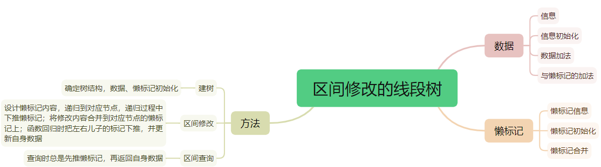
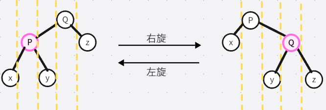

# 数据结构

- [数据结构](#数据结构)
- [第一章 前缀和与差分](#第一章-前缀和与差分)
  - [前缀和](#前缀和)
  - [差分](#差分)
  - [高阶前缀和](#高阶前缀和)
  - [高维前缀和](#高维前缀和)
- [第二章 树状数组与线段树](#第二章-树状数组与线段树)
  - [从前缀和到树状数组](#从前缀和到树状数组)
  - [线段树](#线段树)
- [第三章 势能线段树与李超线段树](#第三章-势能线段树与李超线段树)
  - [势能](#势能)
  - [势能均摊复杂度](#势能均摊复杂度)
  - [势能线段树](#势能线段树)
  - [李超线段树](#李超线段树)
- [第四章 平衡树与伸展树](#第四章-平衡树与伸展树)
  - [二叉树](#二叉树)
  - [平衡二叉树](#平衡二叉树)
  - [树旋转](#树旋转)
  - [Splay](#splay)
  - [用平衡树维护区间](#用平衡树维护区间)
  - [树旋转与换根 $DP$](#树旋转与换根-dp)
- [第五章 跳表](#第五章-跳表)
  - [跳表和倍增](#跳表和倍增)
  - [跳表](#跳表)
- [第六章 数组分块与莫队](#第六章-数组分块与莫队)
  - [分块](#分块)
  - [莫队](#莫队)
  - [树上莫队](#树上莫队)
  - [带修改的莫队](#带修改的莫队)
  - [回滚莫队](#回滚莫队)
- [第七章 可持久化数据结构](#第七章-可持久化数据结构)
  - [简介](#简介)
  - [可持久化线段树](#可持久化线段树)
  - [区间第 $k$ 大查询](#区间第-k-大查询)
  - [可持久化字典树](#可持久化字典树)
  - [其他可持久化数据结构](#其他可持久化数据结构)
- [第八章 $CDQ$ 分治与整体二分](#第八章-cdq-分治与整体二分)
  - [简介](#简介-1)
  - [$CDQ$ 分治](#cdq-分治)
  - [整体二分](#整体二分)


# 第一章 前缀和与差分
## 前缀和
> 给定 $a_1,a_2,\ldots,a_n$，随后进行 $m$ 次查询，每次问 $[l,r]$ 区间的元素和。

定义 $a_i$ 的前缀和 $s_i=\sum\limits_{j=1}^i a_i$，特殊的$s_0=0$，那么答案为 $s_r-s_{l-1}$。

前缀和的扩展

广义前缀和运算是指连续的进行若干次操作，产生叠加影响，这个影响可以通过反向操作来“撤销”；  
形式化的说，元素 $a$ 具有加法操作、加法结合律、逆元，那么也可以使用前缀和的形式解决，例如满秩矩阵的链乘、多项式的卷积，一次函数 $y=x+a$ 的复合运算等。

## 差分
定义 $a_i$ 的差分 $d_1=a_1, d_i=a_i-a_{i-1}\text{ for }i>1$，差分与前缀和互为逆运算。

改变差分数组某个位置 $d_i \leftarrow d_i+x$ ，对应改变原数组的一个后缀 $a_k \leftarrow a_k+x, \text{ for }k \in [i,n]$；  
因此 $d_l \leftarrow d_l+x, d_{r+1} \leftarrow d_{r+1}-x$，相当于改变原数组一段区间 $a_k \leftarrow a_k+x, \text{ for }k \in [l,r]$；

定理：最高次幂为 $n$ 的多项式 $f(x)$ 对应序列 $f(1),f(2),\ldots,f(\infty)$ 做 $n+1$ 次差分后余项为常数，共 $n+1$ 项。  
例如，$f(x)=x+2:[3,4,5,6,7,\ldots] \to [3,1,1,1,1,\ldots] \to [3,-2,0,0,0,\ldots]$，余项 $[3,-2]$。  
$f(x)=(x+1)^2:[2^2,3^2,4^2,5^2,\ldots] \to [4,5,7,9,\ldots] \to [4,1,2,2,\ldots] \to [4,-3,1,0,\ldots]$，余项 $[4,-3,1]$。

也就是说，在序列 $a$ 的 $n+1$ 次差分上前 $n+1$ 个数依次加上余项，相当于在序列 $a$ 上依次加上了多项式序列。

> 给定一个 $a$ 序列，进行$m$ 次操作，每次给一个多项式 $f(x)=c_0+c_1x+\ldots+c_{k_i}x^{k_i}$，使得 $a_x \leftarrow a_x+f(x-l_i+1),x\in [l_i,r_i]$，输出所有操作进行完成后的 $a$ 序列，其中 $|a|\le 10^5,k\le 5$。

1. 转换为差分数组。设 $K = \max(k_i)$ 或者 $K=5$，即把所有多项式看作 $K$ 次，然后对 $a$ 做 $K+1$ 次差分。
2. 在差分数组上操作。对于一次询问，对 $a_x,x\in[l_i,l_i+K]$ 依次加上序列 $f(1),f(2),\ldots,f(K+1)$ 的 $K+1$ 次差分，对 $a_x,x\in[r_i+1,r_i+K+1]$ 依次加上序列 $-f(r-l+2),-f(r-l+3),\ldots,-f(r-l+2+K)$ 的 $K+1$ 次差分
3. 转换回原数组。对 $a$ 做 $K+1$ 次前缀和，得到最终的 $a$ 序列。


## 高阶前缀和
> 求 $a_0,a_1,\ldots,a_{n-1}$ 的 $k$ 阶前缀和，当 $k<0$ 时表示求 $-k$ 阶差分，答案每个元素模上 $P=998244353$。

解：考虑序列 $1,0,0,\ldots$ 的前缀和过程
$$
\begin{array}{c|c}
    A_0 & 1 & 0 & 0 & \cdots \\
    A_1 & 1 & 1 & 1 & \cdots \\
    A_2 & 1 & 2 & 3 & \cdots \\
    A_4 & 1 & 3 & 6 & \cdots
\end{array}\\
A_{i,j}=A_{i,j-1}+A_{i-1,j} \longrightarrow \text{网格图路径数}\\
A_{i,j}=\binom{i-1+j}{j} \longrightarrow \text{$(1,0)$ 到 $(i,j)$ 的路径数}\\
$$

设 $pre_0=a$，$pre_1,pre_2,\ldots,pre_k$ 分别表示 $1,2,\ldots,k$ 阶前缀和序列。  
那么实际上 $a_i$ 对 $pre_{k,j}(j\ge i)$ 的影响就是 $a_i * \binom{k-1+j-i}{j-i}$，更直接的
$$
    pre_{k,j} = \sum_{i=0}^j a_i * \binom{k-1+j-i}{j-i} = \sum_{u+v=j} a_u * \binom{k-1+v}{v}
$$

于是，将 $\{a_i\}$ 的生成函数与 $\{A_{k}\}$ 的生成函数进行多项式卷积即可得到 $pre_k$ 序列。

事实上，求一次前缀和相当于进行卷积：$a(x)=a(x)*(\sum\limits_{i=0}^{n-1}x^i) \bmod {x^n}$，求 $k$ 阶前缀和即 $a(x)=a(x)*(\sum\limits_{i=0}^{n-1}x^i)^k \bmod {x^n} = a(x) \frac{1}{(1-x)^k} \bmod {x^n}$，而 $\{A_{k}\}$ 的生成函数就是 $\frac{1}{(1-x)^k} \bmod {x^n}$，得到的结论相同。

关于 $A_{k,j}$ 的计算：如果 $k$ 很大，无法直接预处理和数来求 $A_{k,j}$。注意到 $\binom{k-1+j}{j} = \frac{k-1+j}{j}\binom{k-1+j-1}{j-1}$，所以 $A_{k,j}=\frac{k-1+j}{j}A_{k,j-1},A_{k,0}=1$，复杂度 $O(n)$。

关于差分的情况：注意到当 $k=P$ 时，$\binom{k-1+v}{v}\equiv 0 \pmod P,\text{ for }v\in[1,n-1]$，即 $A_k=[1,0,0,\ldots]$，所以在模 $P$ 意义下做 $P$ 次前缀和没有任何改变，所以我们一开始对 $k \leftarrow k \bmod P$，就能统一 $k\ge 0$，不存在差分情况。

总复杂度 $O(n\log n)$

## 高维前缀和
定义高维前缀和
$$
    pre_{i,j,k,\ldots}=\sum_{i_0\le i,j_0\le j,k_0\le k,\ldots} a_{i_0,j_0,k_0,\ldots}
$$

又叫子集前缀和，有两种方式求高维前缀和；  
第一种，通过容斥
$$
    pre_{i,j}=a_{i,j}+pre_{i-1,j}+pre_{i,j-1}-pre_{i-1,j-1} \longrightarrow \text{二维，$4$ 项}\\
    pre_{i,j,k}=a_{i,j,k}+\dots \longrightarrow \text{三维，$8$ 项}\\
    \\
    \ldots
    \\
    \text{$w$ 维，$2^w$ 项}
$$
总复杂度 $O(2^w*|a|)$

第二种，分维度前缀和

分 $n$ 个维度进行前缀和，例如二维前缀和
$$
    pre_{i,j} \longleftarrow a_{i,j} \\
    pre_{i,j} \longleftarrow pre_{i,j}+pre_{i-1,j} \\
    pre_{i,j} \longleftarrow pre_{i,j}+pre_{i,j-1} \\
$$
总复杂度 $O(w*|a|)$

特殊的，如果是 $n$ 个维度，每个维度大小为 $2$，即 $pre_S=\sum\limits_{T \subseteq S} a_T$，除了上述方式外，还可以用 $orFWT$ 求（其实就是一个原理）。


# 第二章 树状数组与线段树

## 从前缀和到树状数组
前缀和：$sum_i=\sum\limits_{1\le j\le i} a_j$表示的区间太长，不便于修改。

树状数组：$sum_i=\sum\limits_{i-lowbit(i)+1 \le j\le i} a_j$，其中 $lowbit(i)$ 为 $i$ 在二进制表示下 $1$ 的最低位 $2^w$，可以用 $i\And (-i)$ 快速计算。

求前缀和  
有 $pre_i=sum_i+pre_{i-lowbit(i)}$，依次递归推下去，只有 $\log i$ 项求和，复杂度 $O(\log n)$。

单点修改  
单点修改 $a_i$ 时，设 $w$ 为二进制 $i$ 的最低 $1$ 的位置，那么除了 $sum_i$ 外， $sum_j$ 受影响当且仅当
$$
\begin{cases}
    i < j\\
    j-lowbit(j) < i
\end{cases}
\implies\\
\begin{cases}
    \text{某一位置 } p, i^{(p)}=0,j^{(p)}=1,i^{(x)}=j^{(x)}\text{ for }x>p
    \\
    j^{(x)}=0\text{ for }x<p,\text{ 可以证明 }
\end{cases}
$$
证明：如果不满足此条件，那么 $i^{(p)}=0,(j-lowbit(j))^{(p)}=1,i^{(x)}=(j-lowbit(j))^{(x)}\text{ for }x>p$ 导致 $j-lowbit(j) > i$，出现矛盾。

于是，满足条件的 $j$ 就是在 $w$ 位以上 $i^{(p)}=0$ 的 $p$ 位置，将 $i^{(p)} \leftarrow 1, i^{(x)} \leftarrow 0,\text{ for }x<p$ 得到的。

可以通过递归修改 $change(i) \rightarrow op(i),change(i+lowbit(i))$ 来修改到满足上述条件的 $j$，复杂度 $O(\log n)$。

树状数组局限：
1. 本质是前缀和，同前缀和一样，所维护的数据要满足前缀可减性
2. 单点修改具有局限性，如“带修改的区间 $max$ 问题”，每个位置单点修改要单调递增。

[相关博客：树状数组的区间修改公式推导以及二维树状数组等内容](https://www.cnblogs.com/RabbitHu/p/BIT.html)

## 线段树
用面向对象思想来看线段树，线段树的成员变量有数据、懒标记，成员方法有建树、单点修改、区间修改、区间查询。

线段树的结构这里不介绍了，时间和空间复杂度可以通过比对一颗满二叉树来证明。




个人认为懒标记应该作为一个整体，例如加乘线段树，网上大都认为是合并懒标记时要考虑不同懒标记的优先级，而实际上可以认为懒标记 $\{a,b\}$ 是一个整体，表示影响 $ax+b$，那么懒标记合并其实就是函数的复合。


# 第三章 势能线段树与李超线段树

## 势能
状态量，又称位能。
> 求 $\gcd(a_1,a_2,\ldots,a_n)$ 的时间复杂度

上述时间复杂度是 $O(n+\log C)$ 而不是 $O(n\log C)$，因为 $ans=\gcd(ans,a_i)$ 一直在减少（减半）。

在信息学中，势能被用于计算某一个过程或某一类过程时间复杂度的总和。  
如上述例子中可以定义整个 $\gcd$ 函数被调用的总势能为 $C$，这个势能只会单调减少并且减少的次数是 $\log C$，此时  
$\qquad$  总时间复杂度 $=$ 数组循环遍历复杂度 $+\gcd$ 函数被调用的总复杂度

## 势能均摊复杂度
势能均摊复杂度是把总的时间复杂度均摊到操作次数或者循环次数上面
上述概念来源于一个循环嵌套结构
```python
for i in range(1,n+1):
    f(x)
```
比起用 $\sum O(f)$，我们更倾向于用 $N*O(f)$ 来表示时间复杂度。  
在 $\gcd$ 问题中，$\gcd$ 函数的势能均摊复杂度为 $\frac{O(N+\log C)}{N}=O(1+\frac{\log C}{N})=O(1)$。

用线段树维护区间 $\gcd$，时间复杂度是 $O(n\log n)$ 而不是 $O(n\log^2 n)$。

注意在可持久化数据结构中经常能看到“xx数据结构不支持可持久化，会使势能均摊失效”。

使用“势能均摊”的时候，必须保证函数调用是均匀的，或者整个函数的调用状态是不可重现的。

可持久化的数据由于其 $O(1)$ 的版本记录的特性，显然会使得操作被重现，当然不止于此，任何可重置函数调用状态的操作在均摊算法中都应该被警惕。  
例如，带退格符 $'\backslash b '$ 的 $KMP$ 算法会势能均摊失效（正常 $KMP$ 算法，在 $next$ 匹配失败时均摊 $O(1)$）。

线段树维护区间开平方问题：
- 懒标记无法快速更新整段区间信息
- 暴力开平方，直到变成 $1$

区间开平方这类问题中，如果只需要问最后修改完的状态，还可以使用并查集遍历加速来解决，不需要线段树。

## 势能线段树
所谓势能线段树是指在懒标记无法正常使用的情况下，暴力到叶子，将线段树当成数组一样修改。此时的复杂度需要用势能进行计算，即我们不管在一次暴力中到底一个数节点被访问了几次，单次操作时复杂度可能很大，但这些暴力的总量是有限的，它就是势能上限。

如果势能不是单调递减的，那么必须确保每次对势能提高的上限不能太大。

## 李超线段树

李超线段树是一种维护空间一次函数 $y=kx+b$ 的结构。  
线段树中的一个节点表示一个空间“域”，定义最优势直线为整个区间自上而下覆盖范围最广的直线，线段树中储存的信息是每个空间域最优势的一次函数。

从本质上来讲，李超树是一种标记永久化的线段树，它每次推标记时都会二分向左后向右，不会同时向两边推，这使得他可以暴力推到叶子节点。

传统的单调栈查询最优一次函数是有限制条件的，例如斜率单调或者查询点单调，所以更一般的情况可以用李超线段树或者 $CDQ$ 分治。


# 第四章 平衡树与伸展树

## 二叉树
储存方式
- 数组储存
- 链式储存

遍历方式
- 前序遍历
- 中序遍历
- 后序遍历

二叉树排序、旋转保持平衡

## 平衡二叉树
如果插入一颗二叉排序树的数据依次是 $1,2,3,\ldots$，那么树深度无法得到保证。

这时候出现了各种平衡树：替罪羊、$treap$、$splay$、$SBT$、$fhqtreap$、红黑树、$AVL$ 树。

衡二叉树算法竞赛大概率用不到，找工作面试大概率用得到，尤其是 $c/c++$ 开发岗位，[欢乐互娱面试问到了红黑树](https://www.nowcoder.com/feed/main/detail/71033e112bf24119aa7abf1b5864c0ae?sourceSSR=users)。

## 树旋转
树旋转是为了解决排序二叉树中左右子树深度差过大的问题。

树旋转分为左旋、右旋，扩展一下可以分为左右旋、右左旋、左左旋、右右旋，本质上是只有“之”字型和“一”字型旋转。

方式有右旋转（以 $P$ 为转轴）和左旋转（以 $Q$ 为转轴），互逆。


树旋转的操作建立在排序二叉树的基础上，即它不会破坏排序二又树的性质。

树旋转的本质是旋转轴节点父子关系的改变。  
所以树的旋转其实只有一种，因为当旋转轴是它父亲的左于树时，该旋转只能右旋转；当旋转轴是它父亲的右子树时，该旋转轴只能左旋转。

那么通过以下方式可以把 $x$ 提到根节点：
```python
while x节点不是根:
    rotate(x)
```

但是这样的“单旋”操作是不平衡的，如依次插入 $[1,2,3,4,5,6,7]$，把 $7$ 提到根节点复杂度高，转而采用双旋转：
- 如果当前节点与父亲、父父亲呈“一”字型，那么先旋转父节点，再旋转当前节点
- 如果是“之”字型，那么直接旋转两次当前节点


## Splay
前面将某个节点直接一路提到根的操作称为“伸展”，即 $Splay$ 操作。

伸展树在进行任何一次操作后，都会操作执行这个 $Splay$ 操作将它提到根。

基于 $Splay$ 的关键操作:

$insert(),find(),delete(),kth(),lowerbound(),upperbound(),merge/link(),split/cut(),\ldots$

## 用平衡树维护区间
- 区间拼接
- 区间翻转
- 区间大段插入

$Splay$ 与线段树的区别：
- 一个是“点”树，一个是“区间”树
- $Splay$ 维护的区间是不固定长度的，而线段树是定长的
- $Splay$ 对于查询有自适应能力，但常数大

## 树旋转与换根 $DP$

树族转的本质是父子关系的改变，可用 $link(),cut()$ 来实现。

对于树形 $DP$，有类似于树旋转的思想，可以为换根 $DP$ 做一个类似于多叉树旋转的 $link(),cut()$ 函数


# 第五章 跳表 

## 跳表和倍增
跳表又称 $ST$ 算法，它的本质是一种倍增算法。

倍增是一种基于二进制待定系数的二分思路，它在一定程度上比 $l,r,mid$ 二分的形式需要考虑的边界问题更少，不过常数更大。

```cpp
int x = l-1;
for(int i=LOG; i>=0; --i)
    if(check(x + (1<<i)))
        x += 1<<i;
```

倍增常用于链式结构，例如树上倍增。因为链表不像数组一样空间连续，无法用 $l,r,mid$ 这种形式来二分。

## 跳表
跳表是为了解决静态查询问题，跳表的真正优势在于，预处理时间和查询时间不对等（预处理 $O(N\log N)$，查询 $O(1)$），如 $N=10^5,Q=10^7$ 且强制在线。

跳表有两种：
- 步长为根号的根号跳表
- 步长为二进制倍增的倍增跳表

根号跳表

预处理：设 $B = \sqrt N$，开两个表 $small[N][B],big[N][B]$，其中 $small_{i,j}$ 统计区间 $[i,i+j-1]$，$big_{i,j}$ 统计区间 $[i,i+j*B-1]$，时空复杂度 $O(N\sqrt N)$

查询：查询 $max(a_l,\ldots,a_r)$，转化为 $max(big_{l, \lfloor \frac{r-l+1}{B} \rfloor}, small_{r-(r-l+1)\%B+1, (r-l+1)\%B})$，时间复杂度 $O(1)$。

总结：大小分治，大步小步。利用了 $\forall x \in [1,N],x=i*\sqrt N + j$ 使得原来的区间总是可以拆分两部分。事实上，此算法还可以进一步扩展，例如 $B=N^\frac{1}{3}$，开三个表，使得一次查询分三部分，这样空间复杂度就是 $O(N*N^\frac{1}{3})$ 更优秀，但时间常数大一点点。

> $10^7$ 次查询 $fibonacci$ 数列的第 $k(k \le 10^9)$ 项

解法：注意到查询次数达到了 $10^7$，单次查询 $O(\log 10^9)$ 也会超时，但注意到 $B = \sqrt {10^9} \approx 3*10^4$，于是预处理 $A^0,A^1,\ldots,A^B$ 以及 $A^B,A^{2B},\ldots,A^{BB}$，可以做到 $O(1)$ 查询，此算法称为光速幂。

倍增跳表

预处理：设 $LOG = \log_2 N$，开表 $f[N][LOG]$，$f[i][j]$ 统计 $[i,i+2^j-1]$ 的信息，时空复杂度 $O(N\log N)$。

查询：查询 $max(a_l,\ldots,a_r)$，设 $k=\log_2 (r-l+1)$，转化为 $max(f[l][k],f[r-2^k+1][k])$，时间复杂度 $O(1)$。

两种跳表比较：
- 区间信息可以重复合并，如区间或，$max,min,gcd$ 等，倍增跳表 $O(N\log N)$ 占优势。
- 区间信息不可以重复合并，如最大子段和等，根号跳表占优势。当然倍增跳表也能查询，但是要查询 $\log N$ 段，相当于根号跳表的扩展中 $B=2$ 的情况。


# 第六章 数组分块与莫队

## 分块
设 $B=\sqrt N$，把序列分成 $B$ 段，每段 $B$ 个元素。

定义 $L[B],R[B],size[B],belong[N]$，其中 $L_i,R_i$ 表示块 $i$ 的左右边界，$size_i$ 表示块 $i$ 的大小，$belong_i$ 表示元素 $i$ 属于第几块。

查询：中间整块直接利用统计好的信息加速查询，两边小块暴力遍历，时间复杂度 $O(\sqrt N)$。

修改：对中间整块加懒标记，两边小块暴力修改，时间复杂度 $O(\sqrt N)$。

分块是优雅的暴力，分块还可以进行块内排序，块内二分查找等。

## 莫队
莫队是一种将所有询问排序、暴力扩收区间的离线算法。

排序：
1. 左端点按 $L/B$ 分组排序
2. 组别相同的情况下，右端点按大小排序

处理询问：
1. 初始化区间为 $[1,0]$，初始化信息
2. 每次 $[l_{i-1},r_{i-1}] \to [l_i,r_i]$ 先扩展，后收缩，在扩收过程中更新区间信息，记录答案 $ans_{id_i}$

查询总复杂度为 $\sum |l_i-l_{i-1}| + \sum |r_i-r_{i-1}| \le B*M+N*\frac{N}{B}$。

若 $N,M$ 同阶，取 $B=\sqrt N$ 时，时间复杂度为 $O(N\sqrt N)$。

## 树上莫队
子树查询：转化为 $dfs$ 序的莫队。

树链查询：转化为欧拉序的莫队。

## 带修改的莫队
设计询问数据为 $(id,l,r,t)$ 多加一个时间维度，或者说版本维度，取 $B=n^\frac{2}{3}$，时间复杂度为 $O(n^\frac{5}{3})$。

## 回滚莫队
又叫只增加/只删除莫队，当然不只有增加操作，还有一个撤销操作来代替删除。

时间复杂度同普通莫队。


# 第七章 可持久化数据结构

## 简介
可持久化数据结构要求在每次进行数据结构的维护后都保存一个历史版本，并且支持这些历史版本的数据结构进行再操作。

具有 $O(1)$ 的版本维护和拷贝的特性，比如 $O(1)$ 复制整个数据结构，$O(1)$ 回退到某个历史版本。

例如
$$
    version_0: [0,0,0,0]\\
    a_0 \leftarrow 5,version_1: [5,0,0,0]\\
    a_1 \leftarrow 3,version_2: [5,3,0,0]\\
    a_1 \leftarrow 6,version_3: [5,6,0,0]
$$

可持久化数组：
- 对某个下标的元素修改，每次修改后都记录一个版本编号 $ver_i$
- 对某个版本号的数组给定下标进行查询

暴力实现：用二维数组，时间复杂度瓶颈在于数组拷贝，空间复杂度瓶颈在于数组拷贝时要新开一段内存

瓶颈解决办法：参考 $Fibonacci$ 数列记忆化搜索的思想，复用一些节点信息，把“树”压缩成“$DAG$ 图”的形式来节约内存。

## 可持久化线段树
实际上，主席树的下一个版本最多只需要更改 $2\log n$ 个节点，有大量的信息可以复用。

实现方式：
1. 先铺地基，新版本开少量的点
2. 不铺地基，动态开点，需要时开

可以把主席树看做一个“二维数组”。

每个版本的主席树实际上是一个修改操作的前缀和，利用这一点可以在一个数组 $[a_1,\ldots, a_n]$ 上从左到右依次建一棵树，版本分别为 $0$ ~ $n$。查询区间 $[l,r]$ 信息就可以利用 $r$ 版本减去 $l-1$ 版本的信息来得到结果。

## 区间第 $k$ 大查询
维护一个“二维数组”，第一维是数轴，第二维是数组前缀 $Count$，利用两颗树的版本差进行二分可以找到第 $k$ 大

所以有一类类似“二维数据结构”的问题。本质来讲他们是偏序关系，可以用主席树或者离线后用线段树解决。
例如查询区间 $[l,r]$ 中值域在 $[L,R]$ 的数字之和，也像一个“二维数组”。

## 可持久化字典树
> 查询 $x$ 与 $a_l,\ldots,a_r$ 异或的最大值/最小值。

解决办法同主席树，二维数组做差，如果做差后为 $0$，说明 $[l,r]$ 没有插入过这段数字，不能继续向后面二分。

## 其他可持久化数据结构
可持久化因为 $O(1)$ 版本回退的特性，使得所有操作变成可重现操作，所以所有带均摊势能的数据结构都不支持可持续化，如路径压缩的并查集。

但是按秩合并的并查集支持可持久化，可持久化并查集 $=$ 可持久化数组 $+$ 按秩合并并查集。

绝大部分平衡树都不支持可持久化（因为树旋转带均摊势能），除了非旋 $Treap$ 等不靠旋转实现的树。

有些可持久化数据结构有着非常有趣的特性，比如可持久化可并堆，由于它可以合并以及自我复制，所以可以在有限的次数内存放非常巨大的数据量，同时节约大量内存。


# 第八章 $CDQ$ 分治与整体二分

## 简介
$CDQ$ 分治与整体二分都是离线算法，他们之间的关系就像莫队和分块一样，底层的思想时同源的，但算法原运作又完全不一样。

传统的二分类数据结构题，如树状数组、线段树、主席树、李超树，如果能离线，那么他们往往是万能替代品。

## $CDQ$ 分治
其前身是“分治求逆序对”，整个算法来自于“归并排序”的扩展。

“逆序对”是一个典型的偏序约束关系
$$
\begin{cases}
    i>j\\
    a_i < a_j
\end{cases}
$$
对于这种约束条件，如果接下来的操作不复杂，可以用线段树等解决，如果操作复杂（如嵌套其他数据结构），可以尝试用 $CDQ$ 分治来解偏序。

[智乃的$CDQ$分治详解](https://blog.nowcoder.net/n/f44d4aada5a24f619442dd6ddffa7320)


## 整体二分
对于一个询问二分的 $check$ 不是 $O(1)$ （可能是 $O(n)$ ）的时候，如果能一轮 $O(n)$ 的复杂度 $check$ 全部测试，而整体测试最多指挥进行 $\log A$ 轮，总复杂度能得到保证。

整体二分的经典例题是区间查询第 $k$ 大，并且天然支持带修改，总复杂度为 $O(m\log 10^9\log n)$ 或者 $O(m\log^2 n)$（离散化）。

例题
- [带修改区间查询第 k 大](https://www.luogu.com.cn/problem/P2617)
- [[ZJOI2013] K大数查询](https://www.luogu.com.cn/problem/P3332)
- [2024湖南多校10：区间等差数列，查询小于0的个数](https://codeforces.com/gym/518619/problem/E)


